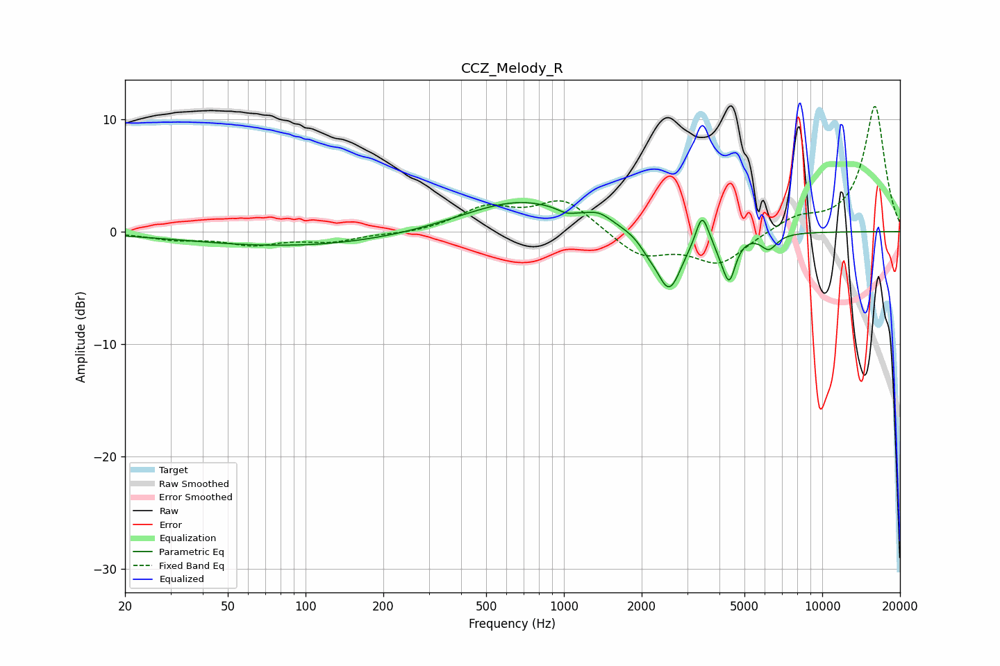

# CCZ_Melody_R
See [usage instructions](https://github.com/jaakkopasanen/AutoEq#usage) for more options and info.

### Parametric EQs
Apply preamp of -2.7 dB when using parametric equalizer.

|   # | Type    |   Fc (Hz) |    Q |   Gain (dB) |
|-----|---------|-----------|------|-------------|
|   1 | Peaking |        92 | 0.34 |        -1.3 |
|   2 | Peaking |       677 | 0.63 |         2.8 |
|   3 | Peaking |      1024 | 4.13 |        -0.4 |
|   4 | Peaking |      1372 | 3.11 |         0.7 |
|   5 | Peaking |      2117 | 4.31 |        -0.7 |
|   6 | Peaking |      2554 | 2.83 |        -5.3 |
|   7 | Peaking |      3427 | 5.99 |         2.7 |
|   8 | Peaking |      4030 | 6    |        -0.7 |
|   9 | Peaking |      4365 | 5.62 |        -3.8 |
|  10 | Peaking |      6217 | 4.41 |        -1.4 |

### Fixed Band EQs
When using fixed band (also called graphic) equalizer, apply preamp of **-11.2 dB** (if available) and set gains manually with these parameters.

|   # | Type    |   Fc (Hz) |    Q |   Gain (dB) |
|-----|---------|-----------|------|-------------|
|   1 | Peaking |        31 | 1.41 |        -0.6 |
|   2 | Peaking |        62 | 1.41 |        -1   |
|   3 | Peaking |       125 | 1.41 |        -0.8 |
|   4 | Peaking |       250 | 1.41 |        -0.2 |
|   5 | Peaking |       500 | 1.41 |         2   |
|   6 | Peaking |      1000 | 1.41 |         2.8 |
|   7 | Peaking |      2000 | 1.41 |        -2.2 |
|   8 | Peaking |      4000 | 1.41 |        -2.8 |
|   9 | Peaking |      8000 | 1.41 |         1.2 |
|  10 | Peaking |     16000 | 1.41 |        11.2 |

### Graphs

