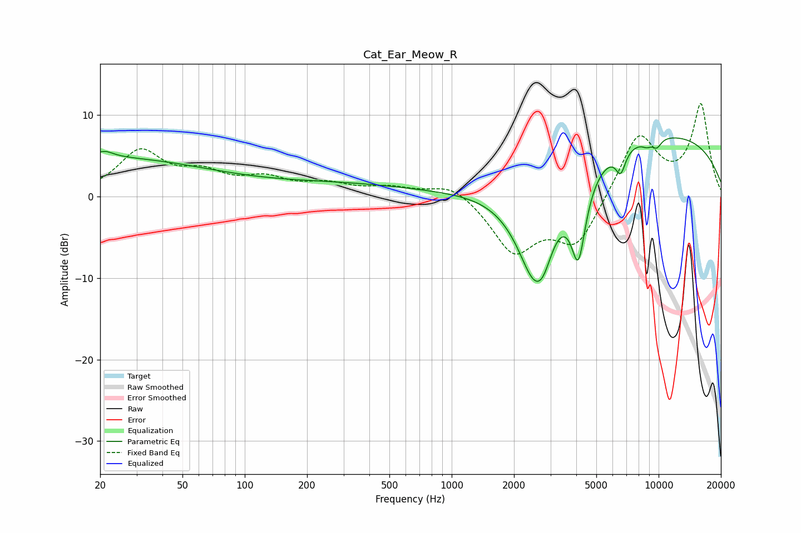

# Cat_Ear_Meow_R
See [usage instructions](https://github.com/jaakkopasanen/AutoEq#usage) for more options and info.

### Parametric EQs
Apply preamp of -7.3 dB when using parametric equalizer.

|   # | Type    |   Fc (Hz) |    Q |   Gain (dB) |
|-----|---------|-----------|------|-------------|
|   1 | Peaking |        20 | 0.25 |         4.7 |
|   2 | Peaking |        21 | 3.33 |         0.8 |
|   3 | Peaking |       284 | 0.37 |         1.4 |
|   4 | Peaking |      2488 | 1.46 |       -11.4 |
|   5 | Peaking |      2760 | 3.15 |        -2.9 |
|   6 | Peaking |      4094 | 3.8  |        -9.6 |
|   7 | Peaking |      6556 | 5.77 |        -2.7 |
|   8 | Peaking |      8784 | 5.04 |        -0.7 |
|   9 | Peaking |      9691 | 0.23 |         7.8 |
|  10 | Peaking |      9812 | 5.6  |        -1.1 |

### Fixed Band EQs
When using fixed band (also called graphic) equalizer, apply preamp of **-11.5 dB** (if available) and set gains manually with these parameters.

|   # | Type    |   Fc (Hz) |    Q |   Gain (dB) |
|-----|---------|-----------|------|-------------|
|   1 | Peaking |        31 | 1.41 |         5.3 |
|   2 | Peaking |        62 | 1.41 |         2.3 |
|   3 | Peaking |       125 | 1.41 |         1.9 |
|   4 | Peaking |       250 | 1.41 |         1.3 |
|   5 | Peaking |       500 | 1.41 |         1   |
|   6 | Peaking |      1000 | 1.41 |         1.8 |
|   7 | Peaking |      2000 | 1.41 |        -6.6 |
|   8 | Peaking |      4000 | 1.41 |        -5.9 |
|   9 | Peaking |      8000 | 1.41 |         7.8 |
|  10 | Peaking |     16000 | 1.41 |        11.1 |

### Graphs

