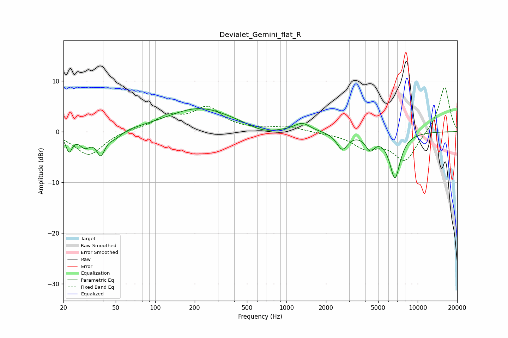

# Devialet_Gemini_flat_R
See [usage instructions](https://github.com/jaakkopasanen/AutoEq#usage) for more options and info.

### Parametric EQs
Apply preamp of -4.6 dB when using parametric equalizer.

|   # | Type    |   Fc (Hz) |    Q |   Gain (dB) |
|-----|---------|-----------|------|-------------|
|   1 | Peaking |        22 | 5.85 |        -3.4 |
|   2 | Peaking |        29 | 3.24 |        -2.6 |
|   3 | Peaking |        38 | 4.39 |        -4.1 |
|   4 | Peaking |        49 | 2.66 |        -1.3 |
|   5 | Peaking |       219 | 0.56 |         4.6 |
|   6 | Peaking |       661 | 1.35 |        -1.1 |
|   7 | Peaking |      1318 | 2.44 |         1.6 |
|   8 | Peaking |      2658 | 3.42 |        -3.3 |
|   9 | Peaking |      4347 | 3.93 |        -2.8 |
|  10 | Peaking |      6712 | 3.23 |        -8.9 |

### Fixed Band EQs
When using fixed band (also called graphic) equalizer, apply preamp of **-8.8 dB** (if available) and set gains manually with these parameters.

|   # | Type    |   Fc (Hz) |    Q |   Gain (dB) |
|-----|---------|-----------|------|-------------|
|   1 | Peaking |        31 | 1.41 |        -4.7 |
|   2 | Peaking |        62 | 1.41 |         0.4 |
|   3 | Peaking |       125 | 1.41 |         2.7 |
|   4 | Peaking |       250 | 1.41 |         4.5 |
|   5 | Peaking |       500 | 1.41 |         0.2 |
|   6 | Peaking |      1000 | 1.41 |         1   |
|   7 | Peaking |      2000 | 1.41 |        -0.2 |
|   8 | Peaking |      4000 | 1.41 |        -2.9 |
|   9 | Peaking |      8000 | 1.41 |        -5.8 |
|  10 | Peaking |     16000 | 1.41 |         9.1 |

### Graphs

