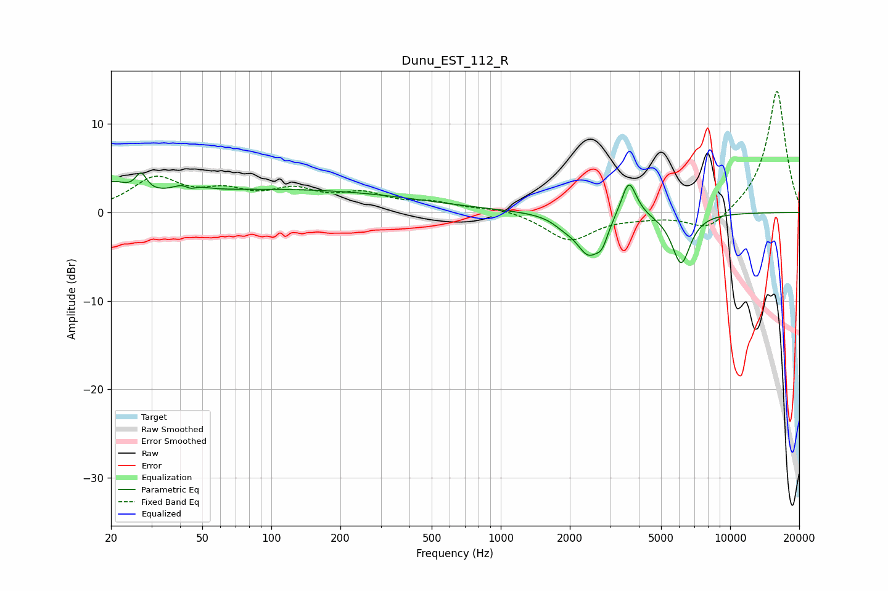

# Dunu_EST_112_R
See [usage instructions](https://github.com/jaakkopasanen/AutoEq#usage) for more options and info.

### Parametric EQs
Apply preamp of -4.6 dB when using parametric equalizer.

|   # | Type    |   Fc (Hz) |    Q |   Gain (dB) |
|-----|---------|-----------|------|-------------|
|   1 | Peaking |        20 | 2.18 |         2.2 |
|   2 | Peaking |        27 | 5.89 |         2.1 |
|   3 | Peaking |        44 | 3.13 |         1.9 |
|   4 | Peaking |        44 | 4.84 |        -1.4 |
|   5 | Peaking |       108 | 0.23 |         2.6 |
|   6 | Peaking |      1883 | 2.95 |        -0.7 |
|   7 | Peaking |      2417 | 2.58 |        -4.5 |
|   8 | Peaking |      2767 | 5.8  |        -1.7 |
|   9 | Peaking |      3618 | 4.21 |         4.4 |
|  10 | Peaking |      6113 | 3.4  |        -5.7 |

### Fixed Band EQs
When using fixed band (also called graphic) equalizer, apply preamp of **-13.8 dB** (if available) and set gains manually with these parameters.

|   # | Type    |   Fc (Hz) |    Q |   Gain (dB) |
|-----|---------|-----------|------|-------------|
|   1 | Peaking |        31 | 1.41 |         3.7 |
|   2 | Peaking |        62 | 1.41 |         1.9 |
|   3 | Peaking |       125 | 1.41 |         2.1 |
|   4 | Peaking |       250 | 1.41 |         1.8 |
|   5 | Peaking |       500 | 1.41 |         0.9 |
|   6 | Peaking |      1000 | 1.41 |         0.5 |
|   7 | Peaking |      2000 | 1.41 |        -3.2 |
|   8 | Peaking |      4000 | 1.41 |        -0.4 |
|   9 | Peaking |      8000 | 1.41 |        -2.3 |
|  10 | Peaking |     16000 | 1.41 |        13.9 |

### Graphs

