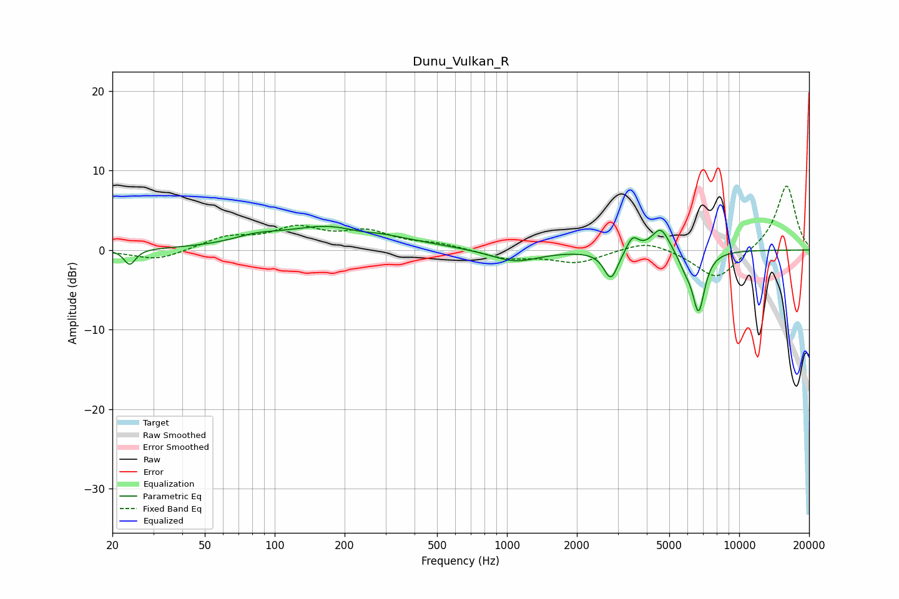

# Dunu_Vulkan_R
See [usage instructions](https://github.com/jaakkopasanen/AutoEq#usage) for more options and info.

### Parametric EQs
Apply preamp of -3.1 dB when using parametric equalizer.

|   # | Type    |   Fc (Hz) |    Q |   Gain (dB) |
|-----|---------|-----------|------|-------------|
|   1 | Peaking |        24 | 5.85 |        -2   |
|   2 | Peaking |        82 | 1.52 |         0.8 |
|   3 | Peaking |       184 | 0.62 |         3.1 |
|   4 | Peaking |       228 | 2.09 |        -0.5 |
|   5 | Peaking |      1082 | 1.36 |        -1.6 |
|   6 | Peaking |      2804 | 4.67 |        -3.6 |
|   7 | Peaking |      3472 | 5.48 |         1.9 |
|   8 | Peaking |      4594 | 3.63 |         3.1 |
|   9 | Peaking |      5850 | 4.58 |        -1.5 |
|  10 | Peaking |      6686 | 5.04 |        -7.5 |

### Fixed Band EQs
When using fixed band (also called graphic) equalizer, apply preamp of **-8.1 dB** (if available) and set gains manually with these parameters.

|   # | Type    |   Fc (Hz) |    Q |   Gain (dB) |
|-----|---------|-----------|------|-------------|
|   1 | Peaking |        31 | 1.41 |        -1.3 |
|   2 | Peaking |        62 | 1.41 |         1.5 |
|   3 | Peaking |       125 | 1.41 |         2.5 |
|   4 | Peaking |       250 | 1.41 |         2   |
|   5 | Peaking |       500 | 1.41 |         0.7 |
|   6 | Peaking |      1000 | 1.41 |        -1   |
|   7 | Peaking |      2000 | 1.41 |        -1.6 |
|   8 | Peaking |      4000 | 1.41 |         1.3 |
|   9 | Peaking |      8000 | 1.41 |        -3.8 |
|  10 | Peaking |     16000 | 1.41 |         8.3 |

### Graphs

