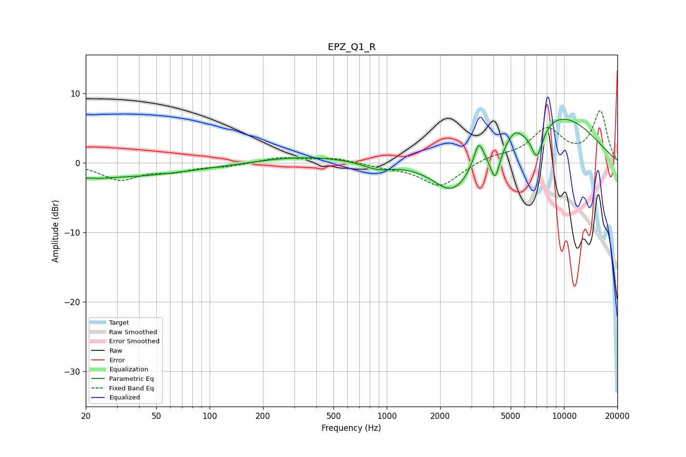

# EPZ_Q1_R
See [usage instructions](https://github.com/jaakkopasanen/AutoEq#usage) for more options and info.

### Parametric EQs
Apply preamp of -6.3 dB when using parametric equalizer.

|   # | Type    |   Fc (Hz) |    Q |   Gain (dB) |
|-----|---------|-----------|------|-------------|
|   1 | Peaking |        20 | 0.23 |        -2.2 |
|   2 | Peaking |        24 | 5.94 |        -0.1 |
|   3 | Peaking |       344 | 0.59 |         0.9 |
|   4 | Peaking |       887 | 1.82 |        -1   |
|   5 | Peaking |      2354 | 1.27 |        -5.1 |
|   6 | Peaking |      3297 | 5.28 |         3.5 |
|   7 | Peaking |      4083 | 5.37 |        -4.3 |
|   8 | Peaking |      5239 | 3.85 |         1.3 |
|   9 | Peaking |      7029 | 3.83 |        -4.9 |
|  10 | Peaking |      9015 | 0.48 |         6.9 |

### Fixed Band EQs
When using fixed band (also called graphic) equalizer, apply preamp of **-7.6 dB** (if available) and set gains manually with these parameters.

|   # | Type    |   Fc (Hz) |    Q |   Gain (dB) |
|-----|---------|-----------|------|-------------|
|   1 | Peaking |        31 | 1.41 |        -2.3 |
|   2 | Peaking |        62 | 1.41 |        -1   |
|   3 | Peaking |       125 | 1.41 |        -0.4 |
|   4 | Peaking |       250 | 1.41 |         0.7 |
|   5 | Peaking |       500 | 1.41 |         0.7 |
|   6 | Peaking |      1000 | 1.41 |        -0.5 |
|   7 | Peaking |      2000 | 1.41 |        -3.5 |
|   8 | Peaking |      4000 | 1.41 |         0.9 |
|   9 | Peaking |      8000 | 1.41 |         4.6 |
|  10 | Peaking |     16000 | 1.41 |         7.3 |

### Graphs

