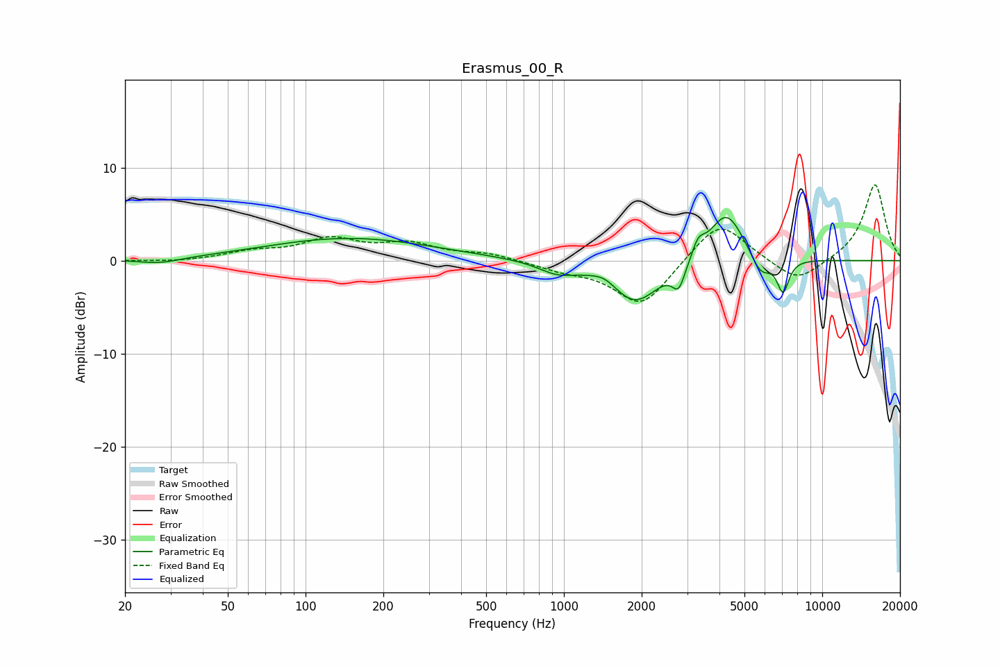

# Erasmus_00_R
See [usage instructions](https://github.com/jaakkopasanen/AutoEq#usage) for more options and info.

### Parametric EQs
Apply preamp of -4.7 dB when using parametric equalizer.

|   # | Type    |   Fc (Hz) |    Q |   Gain (dB) |
|-----|---------|-----------|------|-------------|
|   1 | Peaking |        27 | 1.72 |        -0.6 |
|   2 | Peaking |       148 | 0.44 |         2.4 |
|   3 | Peaking |       941 | 1.93 |        -1.2 |
|   4 | Peaking |      1436 | 3.11 |         0.7 |
|   5 | Peaking |      1890 | 1.47 |        -4.6 |
|   6 | Peaking |      2783 | 5.72 |        -2.5 |
|   7 | Peaking |      3314 | 6    |         1.6 |
|   8 | Peaking |      4254 | 2.03 |         5.5 |
|   9 | Peaking |      5778 | 3.5  |        -2.3 |
|  10 | Peaking |      7053 | 6    |        -3.5 |

### Fixed Band EQs
When using fixed band (also called graphic) equalizer, apply preamp of **-8.2 dB** (if available) and set gains manually with these parameters.

|   # | Type    |   Fc (Hz) |    Q |   Gain (dB) |
|-----|---------|-----------|------|-------------|
|   1 | Peaking |        31 | 1.41 |        -0.2 |
|   2 | Peaking |        62 | 1.41 |         0.8 |
|   3 | Peaking |       125 | 1.41 |         2.1 |
|   4 | Peaking |       250 | 1.41 |         1.6 |
|   5 | Peaking |       500 | 1.41 |         0.7 |
|   6 | Peaking |      1000 | 1.41 |        -0.8 |
|   7 | Peaking |      2000 | 1.41 |        -5   |
|   8 | Peaking |      4000 | 1.41 |         4.5 |
|   9 | Peaking |      8000 | 1.41 |        -2.5 |
|  10 | Peaking |     16000 | 1.41 |         8.3 |

### Graphs

