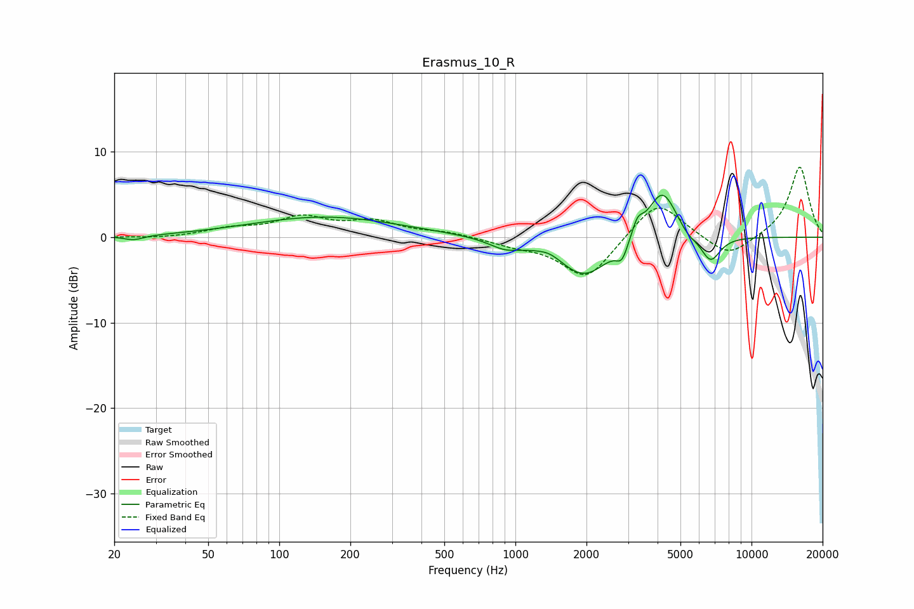

# Erasmus_10_R
See [usage instructions](https://github.com/jaakkopasanen/AutoEq#usage) for more options and info.

### Parametric EQs
Apply preamp of -5.0 dB when using parametric equalizer.

|   # | Type    |   Fc (Hz) |    Q |   Gain (dB) |
|-----|---------|-----------|------|-------------|
|   1 | Peaking |        24 | 3.28 |        -0.5 |
|   2 | Peaking |       156 | 0.45 |         2.4 |
|   3 | Peaking |       905 | 2.02 |        -1.1 |
|   4 | Peaking |      1402 | 3.05 |         0.5 |
|   5 | Peaking |      1959 | 1.29 |        -4.6 |
|   6 | Peaking |      2826 | 5.75 |        -1.9 |
|   7 | Peaking |      3290 | 6    |         1.8 |
|   8 | Peaking |      4187 | 2.23 |         6   |
|   9 | Peaking |      5387 | 3.75 |        -0.8 |
|  10 | Peaking |      6703 | 3.27 |        -3.1 |

### Fixed Band EQs
When using fixed band (also called graphic) equalizer, apply preamp of **-8.3 dB** (if available) and set gains manually with these parameters.

|   # | Type    |   Fc (Hz) |    Q |   Gain (dB) |
|-----|---------|-----------|------|-------------|
|   1 | Peaking |        31 | 1.41 |        -0.2 |
|   2 | Peaking |        62 | 1.41 |         0.9 |
|   3 | Peaking |       125 | 1.41 |         2.1 |
|   4 | Peaking |       250 | 1.41 |         1.7 |
|   5 | Peaking |       500 | 1.41 |         0.5 |
|   6 | Peaking |      1000 | 1.41 |        -0.8 |
|   7 | Peaking |      2000 | 1.41 |        -5   |
|   8 | Peaking |      4000 | 1.41 |         4.6 |
|   9 | Peaking |      8000 | 1.41 |        -2.5 |
|  10 | Peaking |     16000 | 1.41 |         8.3 |

### Graphs

