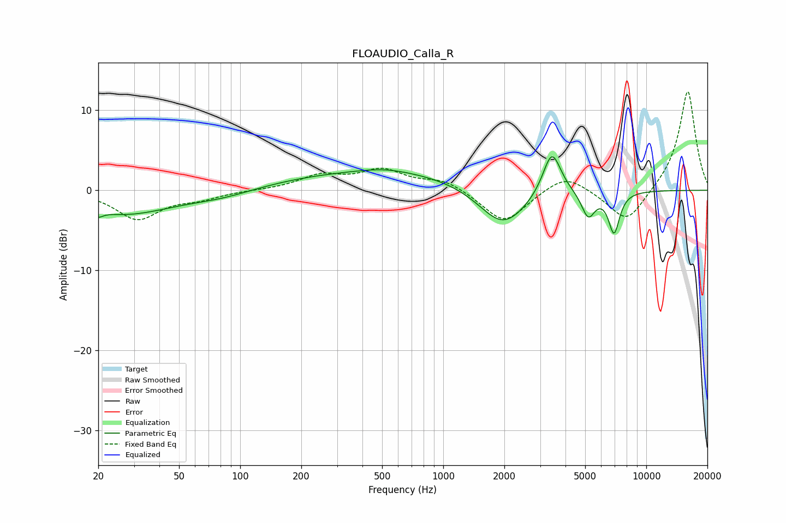

# FLOAUDIO_Calla_R
See [usage instructions](https://github.com/jaakkopasanen/AutoEq#usage) for more options and info.

### Parametric EQs
Apply preamp of -4.3 dB when using parametric equalizer.

|   # | Type    |   Fc (Hz) |    Q |   Gain (dB) |
|-----|---------|-----------|------|-------------|
|   1 | Peaking |        20 | 5.94 |        -3.1 |
|   2 | Peaking |        20 | 5.99 |         2.4 |
|   3 | Peaking |        27 | 0.62 |        -2.9 |
|   4 | Peaking |        81 | 0.82 |        -0.9 |
|   5 | Peaking |       514 | 1.15 |         0.5 |
|   6 | Peaking |       539 | 0.25 |         2.4 |
|   7 | Peaking |      1968 | 1.14 |        -5.5 |
|   8 | Peaking |      3428 | 3.12 |         5.7 |
|   9 | Peaking |      5178 | 4.17 |        -3.2 |
|  10 | Peaking |      6939 | 4.96 |        -5.1 |

### Fixed Band EQs
When using fixed band (also called graphic) equalizer, apply preamp of **-12.4 dB** (if available) and set gains manually with these parameters.

|   # | Type    |   Fc (Hz) |    Q |   Gain (dB) |
|-----|---------|-----------|------|-------------|
|   1 | Peaking |        31 | 1.41 |        -3.5 |
|   2 | Peaking |        62 | 1.41 |        -0.9 |
|   3 | Peaking |       125 | 1.41 |         0   |
|   4 | Peaking |       250 | 1.41 |         1.7 |
|   5 | Peaking |       500 | 1.41 |         2.4 |
|   6 | Peaking |      1000 | 1.41 |         1.3 |
|   7 | Peaking |      2000 | 1.41 |        -4.2 |
|   8 | Peaking |      4000 | 1.41 |         2.2 |
|   9 | Peaking |      8000 | 1.41 |        -4.3 |
|  10 | Peaking |     16000 | 1.41 |        12.6 |

### Graphs

