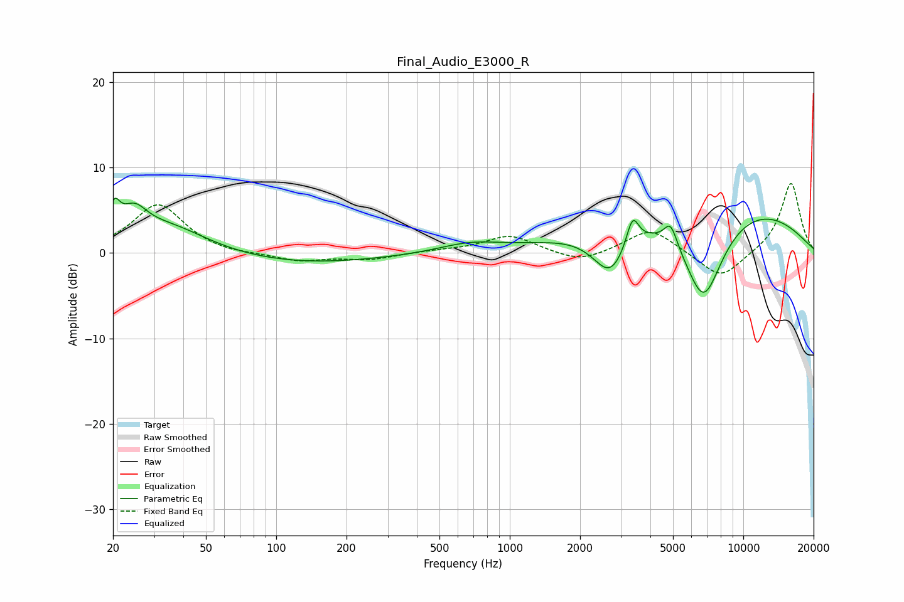

# Final_Audio_E3000_R
See [usage instructions](https://github.com/jaakkopasanen/AutoEq#usage) for more options and info.

### Parametric EQs
Apply preamp of -6.5 dB when using parametric equalizer.

|   # | Type    |   Fc (Hz) |    Q |   Gain (dB) |
|-----|---------|-----------|------|-------------|
|   1 | Peaking |        20 | 5.9  |         3.2 |
|   2 | Peaking |        25 | 2.54 |         3.1 |
|   3 | Peaking |        34 | 0.81 |         3.3 |
|   4 | Peaking |       122 | 0.4  |        -1.3 |
|   5 | Peaking |       675 | 1.07 |         1   |
|   6 | Peaking |      2696 | 1.86 |        -5.4 |
|   7 | Peaking |      3356 | 5.46 |         3.5 |
|   8 | Peaking |      4885 | 4.98 |         2.6 |
|   9 | Peaking |      6753 | 1.45 |       -11.6 |
|  10 | Peaking |      7305 | 0.3  |         7.1 |

### Fixed Band EQs
When using fixed band (also called graphic) equalizer, apply preamp of **-8.2 dB** (if available) and set gains manually with these parameters.

|   # | Type    |   Fc (Hz) |    Q |   Gain (dB) |
|-----|---------|-----------|------|-------------|
|   1 | Peaking |        31 | 1.41 |         5.7 |
|   2 | Peaking |        62 | 1.41 |        -0.3 |
|   3 | Peaking |       125 | 1.41 |        -0.9 |
|   4 | Peaking |       250 | 1.41 |        -0.7 |
|   5 | Peaking |       500 | 1.41 |         0.2 |
|   6 | Peaking |      1000 | 1.41 |         2.1 |
|   7 | Peaking |      2000 | 1.41 |        -1.3 |
|   8 | Peaking |      4000 | 1.41 |         2.9 |
|   9 | Peaking |      8000 | 1.41 |        -3.2 |
|  10 | Peaking |     16000 | 1.41 |         8.3 |

### Graphs

