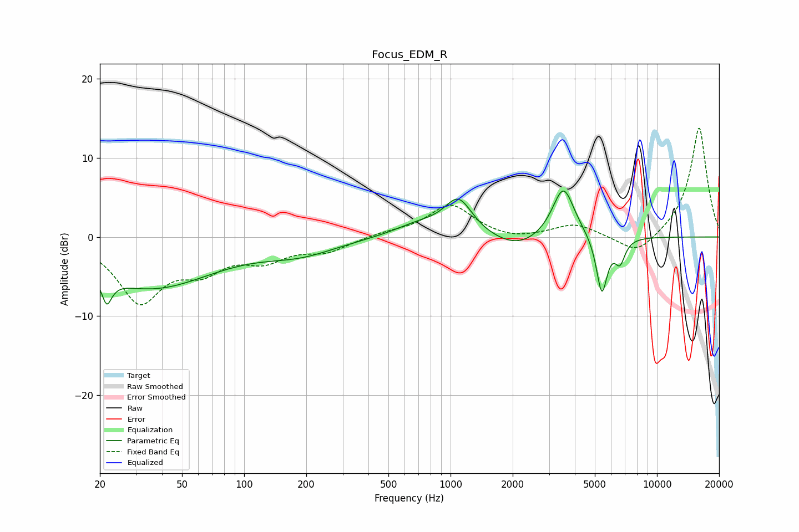

# Focus_EDM_R
See [usage instructions](https://github.com/jaakkopasanen/AutoEq#usage) for more options and info.

### Parametric EQs
Apply preamp of -5.9 dB when using parametric equalizer.

|   # | Type    |   Fc (Hz) |    Q |   Gain (dB) |
|-----|---------|-----------|------|-------------|
|   1 | Peaking |        21 | 5.72 |         3.3 |
|   2 | Peaking |        21 | 5.68 |        -6.6 |
|   3 | Peaking |        35 | 0.46 |        -6.4 |
|   4 | Peaking |       187 | 0.79 |        -1.8 |
|   5 | Peaking |       710 | 1.11 |         1.5 |
|   6 | Peaking |      1093 | 2.11 |         4.4 |
|   7 | Peaking |      2116 | 1.17 |        -1.8 |
|   8 | Peaking |      3519 | 2.6  |         6.7 |
|   9 | Peaking |      5406 | 5.17 |        -7.3 |
|  10 | Peaking |      6618 | 5.52 |        -2.8 |

### Fixed Band EQs
When using fixed band (also called graphic) equalizer, apply preamp of **-13.8 dB** (if available) and set gains manually with these parameters.

|   # | Type    |   Fc (Hz) |    Q |   Gain (dB) |
|-----|---------|-----------|------|-------------|
|   1 | Peaking |        31 | 1.41 |        -7.9 |
|   2 | Peaking |        62 | 1.41 |        -3.4 |
|   3 | Peaking |       125 | 1.41 |        -2.5 |
|   4 | Peaking |       250 | 1.41 |        -1.6 |
|   5 | Peaking |       500 | 1.41 |         0.5 |
|   6 | Peaking |      1000 | 1.41 |         4.1 |
|   7 | Peaking |      2000 | 1.41 |        -0.5 |
|   8 | Peaking |      4000 | 1.41 |         1.6 |
|   9 | Peaking |      8000 | 1.41 |        -2.5 |
|  10 | Peaking |     16000 | 1.41 |        14   |

### Graphs

