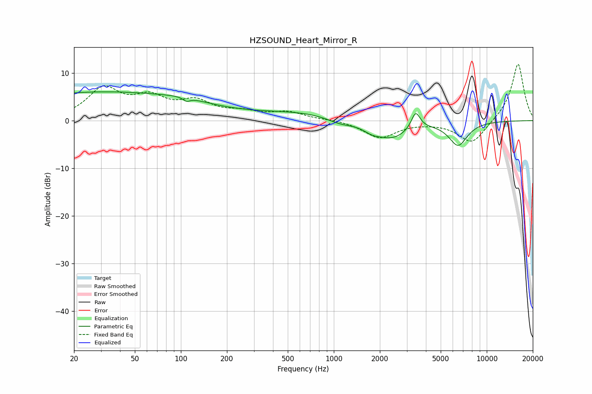

# HZSOUND_Heart_Mirror_R
See [usage instructions](https://github.com/jaakkopasanen/AutoEq#usage) for more options and info.

### Parametric EQs
Apply preamp of -6.1 dB when using parametric equalizer.

|   # | Type    |   Fc (Hz) |    Q |   Gain (dB) |
|-----|---------|-----------|------|-------------|
|   1 | Peaking |        30 | 0.21 |         6   |
|   2 | Peaking |       107 | 1.08 |         0.6 |
|   3 | Peaking |       109 | 5.92 |         3.3 |
|   4 | Peaking |       109 | 6    |        -4.1 |
|   5 | Peaking |       646 | 0.45 |         1.6 |
|   6 | Peaking |      1104 | 1.53 |        -1.3 |
|   7 | Peaking |      1789 | 2.15 |        -1.5 |
|   8 | Peaking |      2444 | 1.34 |        -3.4 |
|   9 | Peaking |      3431 | 4.95 |         3.6 |
|  10 | Peaking |      6498 | 2.24 |        -5   |

### Fixed Band EQs
When using fixed band (also called graphic) equalizer, apply preamp of **-11.9 dB** (if available) and set gains manually with these parameters.

|   # | Type    |   Fc (Hz) |    Q |   Gain (dB) |
|-----|---------|-----------|------|-------------|
|   1 | Peaking |        31 | 1.41 |         6.4 |
|   2 | Peaking |        62 | 1.41 |         4.1 |
|   3 | Peaking |       125 | 1.41 |         3.5 |
|   4 | Peaking |       250 | 1.41 |         1.4 |
|   5 | Peaking |       500 | 1.41 |         1.6 |
|   6 | Peaking |      1000 | 1.41 |         0.2 |
|   7 | Peaking |      2000 | 1.41 |        -3.6 |
|   8 | Peaking |      4000 | 1.41 |        -0.1 |
|   9 | Peaking |      8000 | 1.41 |        -4.9 |
|  10 | Peaking |     16000 | 1.41 |        12.2 |

### Graphs

