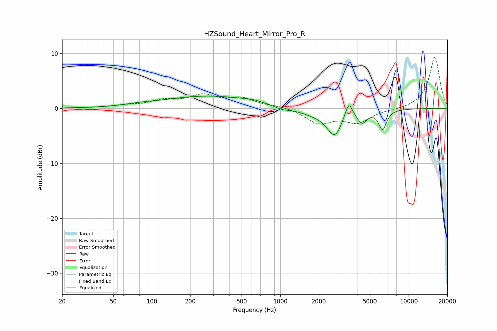

# HZSound_Heart_Mirror_Pro_R
See [usage instructions](https://github.com/jaakkopasanen/AutoEq#usage) for more options and info.

### Parametric EQs
Apply preamp of -2.3 dB when using parametric equalizer.

|   # | Type    |   Fc (Hz) |    Q |   Gain (dB) |
|-----|---------|-----------|------|-------------|
|   1 | Peaking |        80 | 1.33 |         0.2 |
|   2 | Peaking |       279 | 0.39 |         2.2 |
|   3 | Peaking |       605 | 2.17 |         0.3 |
|   4 | Peaking |      1027 | 2.57 |        -0.5 |
|   5 | Peaking |      1769 | 1.1  |        -0.8 |
|   6 | Peaking |      2679 | 2.26 |        -5   |
|   7 | Peaking |      3017 | 3.61 |         0.6 |
|   8 | Peaking |      3422 | 5.16 |         3   |
|   9 | Peaking |      4343 | 3.92 |        -2.1 |
|  10 | Peaking |      6270 | 4.55 |        -3.5 |

### Fixed Band EQs
When using fixed band (also called graphic) equalizer, apply preamp of **-9.4 dB** (if available) and set gains manually with these parameters.

|   # | Type    |   Fc (Hz) |    Q |   Gain (dB) |
|-----|---------|-----------|------|-------------|
|   1 | Peaking |        31 | 1.41 |         0   |
|   2 | Peaking |        62 | 1.41 |         0.4 |
|   3 | Peaking |       125 | 1.41 |         1.3 |
|   4 | Peaking |       250 | 1.41 |         2.1 |
|   5 | Peaking |       500 | 1.41 |         1.6 |
|   6 | Peaking |      1000 | 1.41 |         0.4 |
|   7 | Peaking |      2000 | 1.41 |        -2.6 |
|   8 | Peaking |      4000 | 1.41 |        -2.4 |
|   9 | Peaking |      8000 | 1.41 |        -0.2 |
|  10 | Peaking |     16000 | 1.41 |         9.4 |

### Graphs

