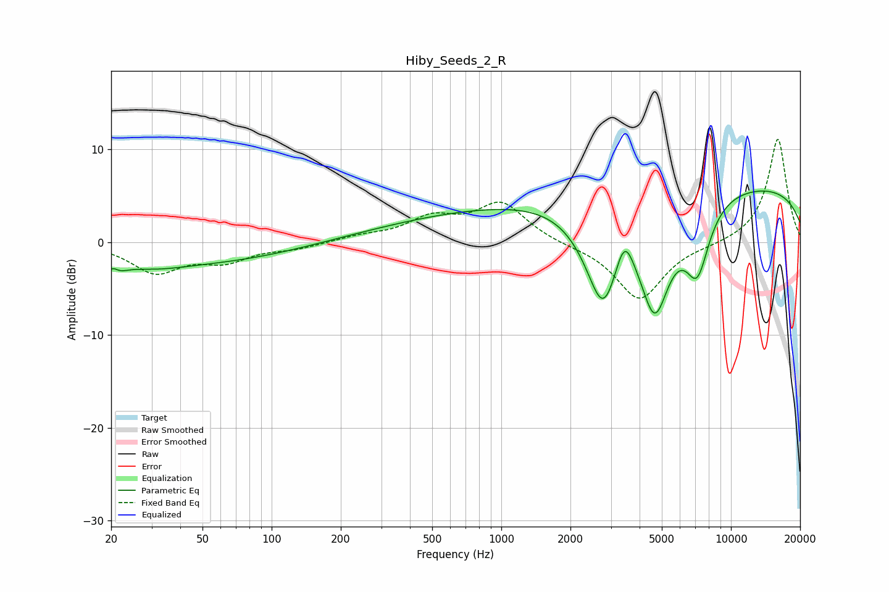

# Hiby_Seeds_2_R
See [usage instructions](https://github.com/jaakkopasanen/AutoEq#usage) for more options and info.

### Parametric EQs
Apply preamp of -5.6 dB when using parametric equalizer.

|   # | Type    |   Fc (Hz) |    Q |   Gain (dB) |
|-----|---------|-----------|------|-------------|
|   1 | Peaking |        20 | 3.45 |        -2.8 |
|   2 | Peaking |        20 | 5.83 |         1.8 |
|   3 | Peaking |        29 | 0.92 |        -1.2 |
|   4 | Peaking |       100 | 0.25 |        -2.6 |
|   5 | Peaking |       698 | 0.18 |         3.8 |
|   6 | Peaking |      2780 | 1.69 |       -11.5 |
|   7 | Peaking |      3432 | 3.35 |         4.3 |
|   8 | Peaking |      4665 | 1.94 |       -11.5 |
|   9 | Peaking |      7133 | 2.49 |        -7.2 |
|  10 | Peaking |     10000 | 0.18 |         6.2 |

### Fixed Band EQs
When using fixed band (also called graphic) equalizer, apply preamp of **-11.2 dB** (if available) and set gains manually with these parameters.

|   # | Type    |   Fc (Hz) |    Q |   Gain (dB) |
|-----|---------|-----------|------|-------------|
|   1 | Peaking |        31 | 1.41 |        -3.1 |
|   2 | Peaking |        62 | 1.41 |        -1.8 |
|   3 | Peaking |       125 | 1.41 |        -0.6 |
|   4 | Peaking |       250 | 1.41 |         0.6 |
|   5 | Peaking |       500 | 1.41 |         2.4 |
|   6 | Peaking |      1000 | 1.41 |         4.1 |
|   7 | Peaking |      2000 | 1.41 |        -0.2 |
|   8 | Peaking |      4000 | 1.41 |        -6.2 |
|   9 | Peaking |      8000 | 1.41 |        -0.2 |
|  10 | Peaking |     16000 | 1.41 |        11.2 |

### Graphs

