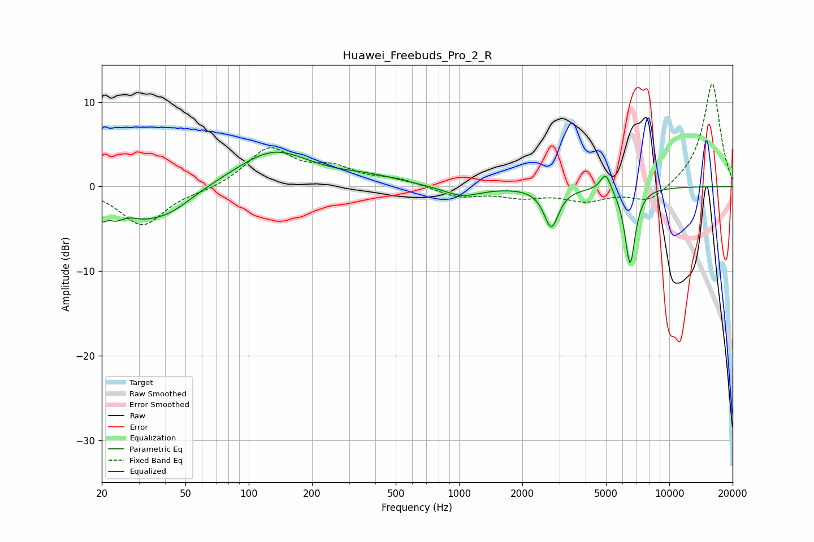

# Huawei_Freebuds_Pro_2_R
See [usage instructions](https://github.com/jaakkopasanen/AutoEq#usage) for more options and info.

### Parametric EQs
Apply preamp of -4.2 dB when using parametric equalizer.

|   # | Type    |   Fc (Hz) |    Q |   Gain (dB) |
|-----|---------|-----------|------|-------------|
|   1 | Peaking |        21 | 2.44 |        -4.5 |
|   2 | Peaking |        22 | 5.52 |         1.5 |
|   3 | Peaking |        31 | 2.35 |        -0.9 |
|   4 | Peaking |        40 | 1.12 |        -3.2 |
|   5 | Peaking |       131 | 0.81 |         4.2 |
|   6 | Peaking |       374 | 0.95 |         0.9 |
|   7 | Peaking |      1032 | 1.6  |        -1.2 |
|   8 | Peaking |      2747 | 4.1  |        -4.6 |
|   9 | Peaking |      4984 | 5.57 |         2.2 |
|  10 | Peaking |      6509 | 5.52 |        -9.2 |

### Fixed Band EQs
When using fixed band (also called graphic) equalizer, apply preamp of **-12.3 dB** (if available) and set gains manually with these parameters.

|   # | Type    |   Fc (Hz) |    Q |   Gain (dB) |
|-----|---------|-----------|------|-------------|
|   1 | Peaking |        31 | 1.41 |        -4.6 |
|   2 | Peaking |        62 | 1.41 |        -0.4 |
|   3 | Peaking |       125 | 1.41 |         4.5 |
|   4 | Peaking |       250 | 1.41 |         1.9 |
|   5 | Peaking |       500 | 1.41 |         0.8 |
|   6 | Peaking |      1000 | 1.41 |        -1.2 |
|   7 | Peaking |      2000 | 1.41 |        -1.1 |
|   8 | Peaking |      4000 | 1.41 |        -1.5 |
|   9 | Peaking |      8000 | 1.41 |        -2   |
|  10 | Peaking |     16000 | 1.41 |        12.4 |

### Graphs

