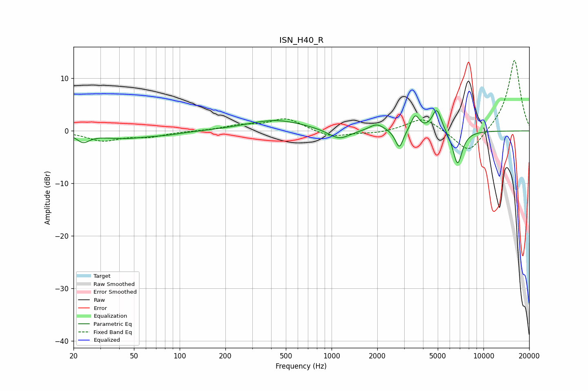

# ISN_H40_R
See [usage instructions](https://github.com/jaakkopasanen/AutoEq#usage) for more options and info.

### Parametric EQs
Apply preamp of -4.0 dB when using parametric equalizer.

|   # | Type    |   Fc (Hz) |    Q |   Gain (dB) |
|-----|---------|-----------|------|-------------|
|   1 | Peaking |        23 | 3.53 |        -1.6 |
|   2 | Peaking |        42 | 0.82 |        -1.3 |
|   3 | Peaking |        84 | 1.26 |        -0.4 |
|   4 | Peaking |       429 | 0.75 |         2.1 |
|   5 | Peaking |      1119 | 2    |        -1.9 |
|   6 | Peaking |      1983 | 2.89 |         1.4 |
|   7 | Peaking |      2793 | 5.47 |        -3.6 |
|   8 | Peaking |      3553 | 5.24 |         3   |
|   9 | Peaking |      4929 | 4.5  |         4.3 |
|  10 | Peaking |      6752 | 4.35 |        -6.5 |

### Fixed Band EQs
When using fixed band (also called graphic) equalizer, apply preamp of **-13.5 dB** (if available) and set gains manually with these parameters.

|   # | Type    |   Fc (Hz) |    Q |   Gain (dB) |
|-----|---------|-----------|------|-------------|
|   1 | Peaking |        31 | 1.41 |        -1.8 |
|   2 | Peaking |        62 | 1.41 |        -1   |
|   3 | Peaking |       125 | 1.41 |        -0   |
|   4 | Peaking |       250 | 1.41 |         0.9 |
|   5 | Peaking |       500 | 1.41 |         2.4 |
|   6 | Peaking |      1000 | 1.41 |        -1.3 |
|   7 | Peaking |      2000 | 1.41 |        -0.5 |
|   8 | Peaking |      4000 | 1.41 |         2.7 |
|   9 | Peaking |      8000 | 1.41 |        -4.6 |
|  10 | Peaking |     16000 | 1.41 |        13.7 |

### Graphs

