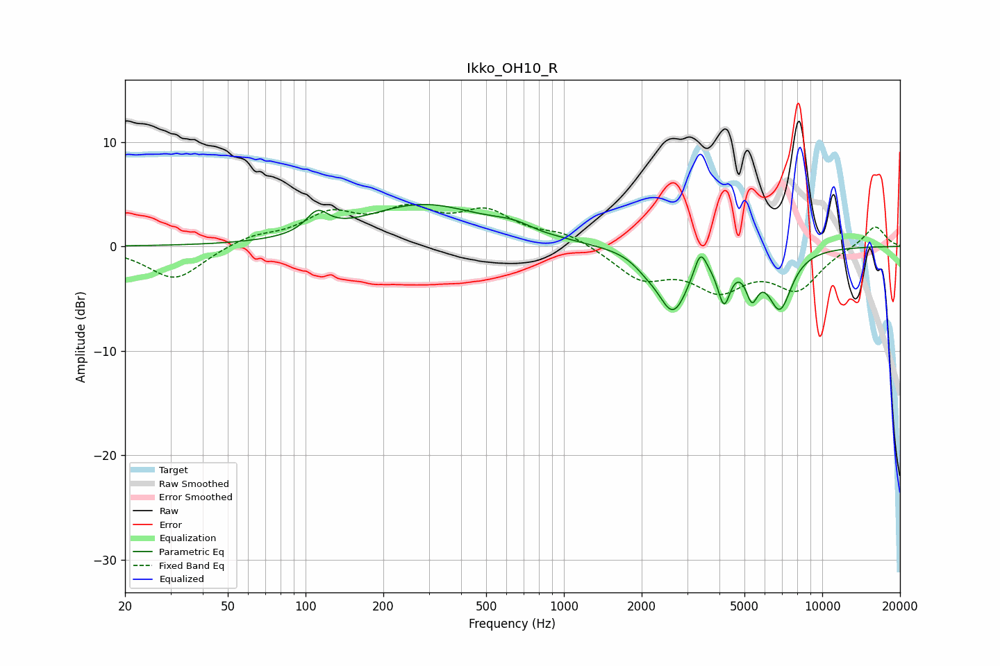

# Ikko_OH10_R
See [usage instructions](https://github.com/jaakkopasanen/AutoEq#usage) for more options and info.

### Parametric EQs
Apply preamp of -4.1 dB when using parametric equalizer.

|   # | Type    |   Fc (Hz) |    Q |   Gain (dB) |
|-----|---------|-----------|------|-------------|
|   1 | Peaking |       111 | 3.33 |         2   |
|   2 | Peaking |       284 | 0.6  |         3.9 |
|   3 | Peaking |       646 | 1.54 |         0.9 |
|   4 | Peaking |       796 | 3.27 |        -0.1 |
|   5 | Peaking |      2073 | 3.16 |        -0.7 |
|   6 | Peaking |      2645 | 2.3  |        -6   |
|   7 | Peaking |      3375 | 5.99 |         2.4 |
|   8 | Peaking |      4168 | 5.77 |        -4.1 |
|   9 | Peaking |      5343 | 5.87 |        -3.2 |
|  10 | Peaking |      6854 | 2.89 |        -5.5 |

### Fixed Band EQs
When using fixed band (also called graphic) equalizer, apply preamp of **-4.1 dB** (if available) and set gains manually with these parameters.

|   # | Type    |   Fc (Hz) |    Q |   Gain (dB) |
|-----|---------|-----------|------|-------------|
|   1 | Peaking |        31 | 1.41 |        -3.2 |
|   2 | Peaking |        62 | 1.41 |         0.9 |
|   3 | Peaking |       125 | 1.41 |         2.8 |
|   4 | Peaking |       250 | 1.41 |         2.9 |
|   5 | Peaking |       500 | 1.41 |         2.9 |
|   6 | Peaking |      1000 | 1.41 |         1.2 |
|   7 | Peaking |      2000 | 1.41 |        -2.9 |
|   8 | Peaking |      4000 | 1.41 |        -3.6 |
|   9 | Peaking |      8000 | 1.41 |        -3.8 |
|  10 | Peaking |     16000 | 1.41 |         2.1 |

### Graphs

