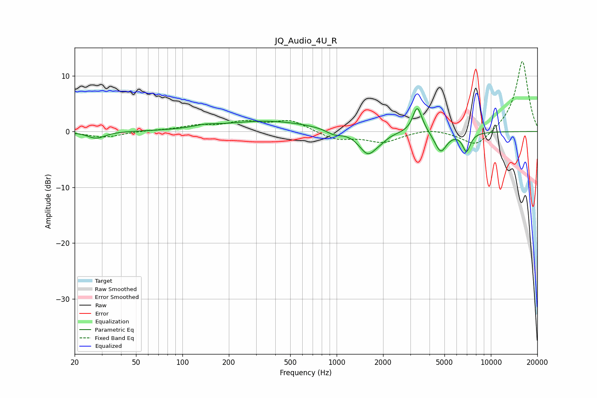

# JQ_Audio_4U_R
See [usage instructions](https://github.com/jaakkopasanen/AutoEq#usage) for more options and info.

### Parametric EQs
Apply preamp of -4.2 dB when using parametric equalizer.

|   # | Type    |   Fc (Hz) |    Q |   Gain (dB) |
|-----|---------|-----------|------|-------------|
|   1 | Peaking |        28 | 2.49 |        -1.2 |
|   2 | Peaking |       140 | 2.03 |         0.4 |
|   3 | Peaking |       354 | 0.49 |         1.9 |
|   4 | Peaking |       962 | 2.86 |        -0.9 |
|   5 | Peaking |      1596 | 2.45 |        -4.1 |
|   6 | Peaking |      1947 | 3.9  |        -0.6 |
|   7 | Peaking |      3319 | 5.12 |         3.8 |
|   8 | Peaking |      3461 | 3.56 |         1.1 |
|   9 | Peaking |      4728 | 3.62 |        -3.7 |
|  10 | Peaking |      6951 | 5.35 |        -3.3 |

### Fixed Band EQs
When using fixed band (also called graphic) equalizer, apply preamp of **-12.7 dB** (if available) and set gains manually with these parameters.

|   # | Type    |   Fc (Hz) |    Q |   Gain (dB) |
|-----|---------|-----------|------|-------------|
|   1 | Peaking |        31 | 1.41 |        -1   |
|   2 | Peaking |        62 | 1.41 |         0.2 |
|   3 | Peaking |       125 | 1.41 |         0.9 |
|   4 | Peaking |       250 | 1.41 |         1.5 |
|   5 | Peaking |       500 | 1.41 |         1.9 |
|   6 | Peaking |      1000 | 1.41 |        -1.4 |
|   7 | Peaking |      2000 | 1.41 |        -1.8 |
|   8 | Peaking |      4000 | 1.41 |         0.6 |
|   9 | Peaking |      8000 | 1.41 |        -2.9 |
|  10 | Peaking |     16000 | 1.41 |        12.8 |

### Graphs

