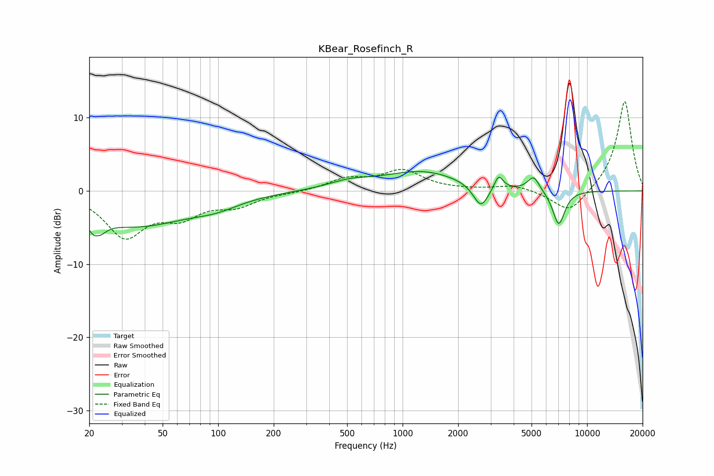

# KBear_Rosefinch_R
See [usage instructions](https://github.com/jaakkopasanen/AutoEq#usage) for more options and info.

### Parametric EQs
Apply preamp of -2.7 dB when using parametric equalizer.

|   # | Type    |   Fc (Hz) |    Q |   Gain (dB) |
|-----|---------|-----------|------|-------------|
|   1 | Peaking |        22 | 4.52 |        -5.6 |
|   2 | Peaking |        22 | 5.95 |         3.2 |
|   3 | Peaking |        36 | 0.49 |        -4.6 |
|   4 | Peaking |        97 | 1.09 |        -1.1 |
|   5 | Peaking |       516 | 1.22 |         1   |
|   6 | Peaking |      1274 | 0.68 |         2.6 |
|   7 | Peaking |      2657 | 3.45 |        -3.2 |
|   8 | Peaking |      3318 | 6    |         2   |
|   9 | Peaking |      5128 | 4.41 |         2   |
|  10 | Peaking |      7021 | 4.07 |        -4.8 |

### Fixed Band EQs
When using fixed band (also called graphic) equalizer, apply preamp of **-12.3 dB** (if available) and set gains manually with these parameters.

|   # | Type    |   Fc (Hz) |    Q |   Gain (dB) |
|-----|---------|-----------|------|-------------|
|   1 | Peaking |        31 | 1.41 |        -6   |
|   2 | Peaking |        62 | 1.41 |        -2.9 |
|   3 | Peaking |       125 | 1.41 |        -1.8 |
|   4 | Peaking |       250 | 1.41 |        -0.2 |
|   5 | Peaking |       500 | 1.41 |         1.5 |
|   6 | Peaking |      1000 | 1.41 |         2.7 |
|   7 | Peaking |      2000 | 1.41 |         0.1 |
|   8 | Peaking |      4000 | 1.41 |         0.8 |
|   9 | Peaking |      8000 | 1.41 |        -3.2 |
|  10 | Peaking |     16000 | 1.41 |        12.4 |

### Graphs

