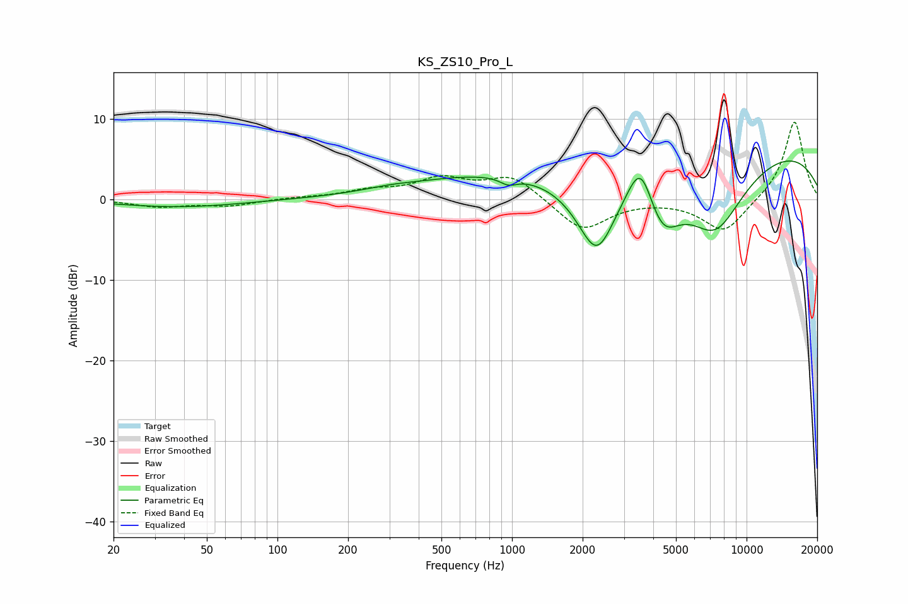

# KS_ZS10_Pro_L
See [usage instructions](https://github.com/jaakkopasanen/AutoEq#usage) for more options and info.

### Parametric EQs
Apply preamp of -4.8 dB when using parametric equalizer.

|   # | Type    |   Fc (Hz) |    Q |   Gain (dB) |
|-----|---------|-----------|------|-------------|
|   1 | Peaking |        39 | 0.54 |        -1   |
|   2 | Peaking |       298 | 1.33 |         0.3 |
|   3 | Peaking |       742 | 0.43 |         2.6 |
|   4 | Peaking |       965 | 3.96 |        -0.9 |
|   5 | Peaking |      2299 | 1.52 |       -10.8 |
|   6 | Peaking |      3515 | 0.44 |         2.4 |
|   7 | Peaking |      3538 | 2.51 |         6.1 |
|   8 | Peaking |      4351 | 1.7  |        -7.1 |
|   9 | Peaking |      7323 | 0.93 |       -10.6 |
|  10 | Peaking |      9787 | 0.22 |         7.1 |

### Fixed Band EQs
When using fixed band (also called graphic) equalizer, apply preamp of **-9.7 dB** (if available) and set gains manually with these parameters.

|   # | Type    |   Fc (Hz) |    Q |   Gain (dB) |
|-----|---------|-----------|------|-------------|
|   1 | Peaking |        31 | 1.41 |        -0.9 |
|   2 | Peaking |        62 | 1.41 |        -0.8 |
|   3 | Peaking |       125 | 1.41 |         0.2 |
|   4 | Peaking |       250 | 1.41 |         0.9 |
|   5 | Peaking |       500 | 1.41 |         2.4 |
|   6 | Peaking |      1000 | 1.41 |         2.9 |
|   7 | Peaking |      2000 | 1.41 |        -4   |
|   8 | Peaking |      4000 | 1.41 |        -0   |
|   9 | Peaking |      8000 | 1.41 |        -4.2 |
|  10 | Peaking |     16000 | 1.41 |         9.8 |

### Graphs

