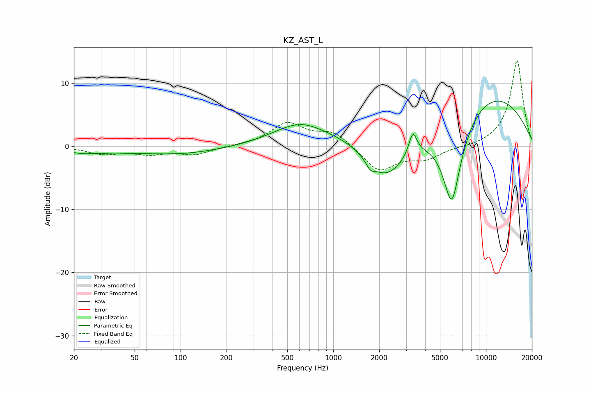

# KZ_AST_L
See [usage instructions](https://github.com/jaakkopasanen/AutoEq#usage) for more options and info.

### Parametric EQs
Apply preamp of -7.2 dB when using parametric equalizer.

|   # | Type    |   Fc (Hz) |    Q |   Gain (dB) |
|-----|---------|-----------|------|-------------|
|   1 | Peaking |        22 | 1.42 |        -0.8 |
|   2 | Peaking |        37 | 1.61 |        -0.4 |
|   3 | Peaking |        94 | 0.49 |        -1.3 |
|   4 | Peaking |       609 | 0.8  |         3.6 |
|   5 | Peaking |      1265 | 0.95 |         0.9 |
|   6 | Peaking |      1749 | 5.36 |        -1.1 |
|   7 | Peaking |      2218 | 1.03 |        -6.4 |
|   8 | Peaking |      3322 | 5.35 |         3.6 |
|   9 | Peaking |      5977 | 1.99 |       -14.7 |
|  10 | Peaking |      9870 | 0.35 |         8.8 |

### Fixed Band EQs
When using fixed band (also called graphic) equalizer, apply preamp of **-13.6 dB** (if available) and set gains manually with these parameters.

|   # | Type    |   Fc (Hz) |    Q |   Gain (dB) |
|-----|---------|-----------|------|-------------|
|   1 | Peaking |        31 | 1.41 |        -1.1 |
|   2 | Peaking |        62 | 1.41 |        -1.1 |
|   3 | Peaking |       125 | 1.41 |        -1.3 |
|   4 | Peaking |       250 | 1.41 |         0.1 |
|   5 | Peaking |       500 | 1.41 |         3.5 |
|   6 | Peaking |      1000 | 1.41 |         2.2 |
|   7 | Peaking |      2000 | 1.41 |        -4   |
|   8 | Peaking |      4000 | 1.41 |        -1.9 |
|   9 | Peaking |      8000 | 1.41 |        -0.2 |
|  10 | Peaking |     16000 | 1.41 |        13.7 |

### Graphs

