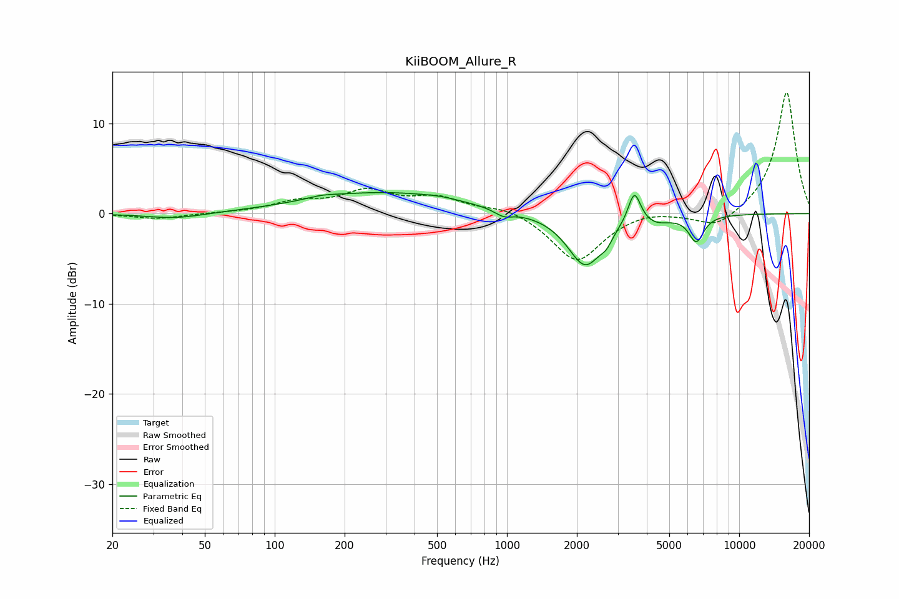

# KiiBOOM_Allure_R
See [usage instructions](https://github.com/jaakkopasanen/AutoEq#usage) for more options and info.

### Parametric EQs
Apply preamp of -2.4 dB when using parametric equalizer.

|   # | Type    |   Fc (Hz) |    Q |   Gain (dB) |
|-----|---------|-----------|------|-------------|
|   1 | Peaking |        37 | 1.13 |        -0.6 |
|   2 | Peaking |       160 | 2.22 |         0.3 |
|   3 | Peaking |       292 | 0.43 |         2.3 |
|   4 | Peaking |       519 | 1.83 |         0.2 |
|   5 | Peaking |       968 | 3.59 |        -0.7 |
|   6 | Peaking |      2174 | 1.86 |        -5.8 |
|   7 | Peaking |      2681 | 6    |        -0.8 |
|   8 | Peaking |      3536 | 5.23 |         3.7 |
|   9 | Peaking |      4390 | 2.39 |        -0.7 |
|  10 | Peaking |      6533 | 4.31 |        -2.9 |

### Fixed Band EQs
When using fixed band (also called graphic) equalizer, apply preamp of **-13.5 dB** (if available) and set gains manually with these parameters.

|   # | Type    |   Fc (Hz) |    Q |   Gain (dB) |
|-----|---------|-----------|------|-------------|
|   1 | Peaking |        31 | 1.41 |        -0.6 |
|   2 | Peaking |        62 | 1.41 |         0.1 |
|   3 | Peaking |       125 | 1.41 |         1.2 |
|   4 | Peaking |       250 | 1.41 |         2.3 |
|   5 | Peaking |       500 | 1.41 |         1.6 |
|   6 | Peaking |      1000 | 1.41 |         0.8 |
|   7 | Peaking |      2000 | 1.41 |        -5.4 |
|   8 | Peaking |      4000 | 1.41 |         0.5 |
|   9 | Peaking |      8000 | 1.41 |        -1.8 |
|  10 | Peaking |     16000 | 1.41 |        13.6 |

### Graphs

