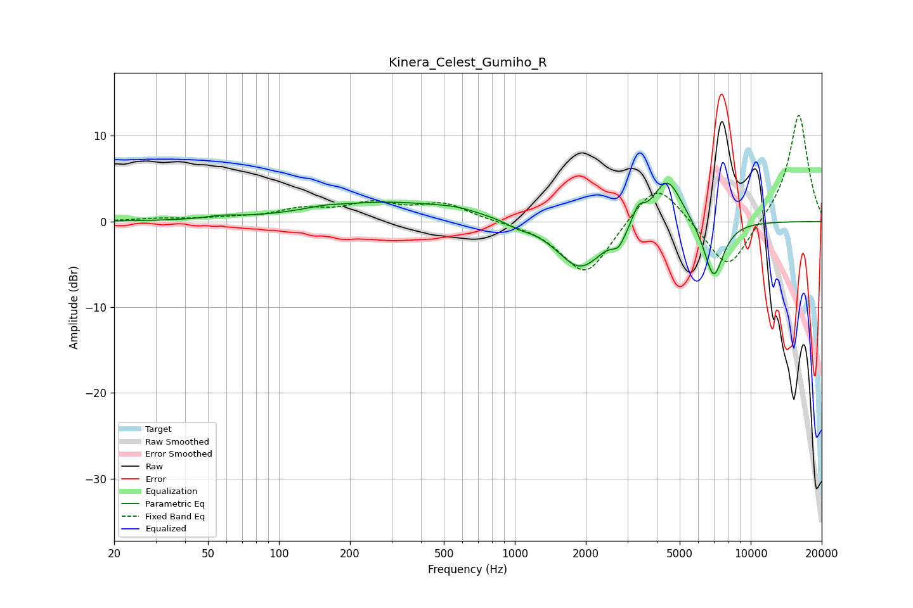

# Kinera_Celest_Gumiho_R
See [usage instructions](https://github.com/jaakkopasanen/AutoEq#usage) for more options and info.

### Parametric EQs
Apply preamp of -4.6 dB when using parametric equalizer.

|   # | Type    |   Fc (Hz) |    Q |   Gain (dB) |
|-----|---------|-----------|------|-------------|
|   1 | Peaking |        57 | 2.13 |         0.3 |
|   2 | Peaking |       155 | 2.11 |         0.3 |
|   3 | Peaking |       292 | 0.45 |         2.2 |
|   4 | Peaking |       573 | 1.65 |         0.4 |
|   5 | Peaking |      1028 | 3.16 |        -0.5 |
|   6 | Peaking |      1894 | 1.4  |        -5.6 |
|   7 | Peaking |      2755 | 5.1  |        -1.6 |
|   8 | Peaking |      3339 | 6    |         1.8 |
|   9 | Peaking |      4429 | 2.21 |         5.6 |
|  10 | Peaking |      6965 | 3.19 |        -6.8 |

### Fixed Band EQs
When using fixed band (also called graphic) equalizer, apply preamp of **-12.5 dB** (if available) and set gains manually with these parameters.

|   # | Type    |   Fc (Hz) |    Q |   Gain (dB) |
|-----|---------|-----------|------|-------------|
|   1 | Peaking |        31 | 1.41 |         0.3 |
|   2 | Peaking |        62 | 1.41 |         0.3 |
|   3 | Peaking |       125 | 1.41 |         1.2 |
|   4 | Peaking |       250 | 1.41 |         1.9 |
|   5 | Peaking |       500 | 1.41 |         2   |
|   6 | Peaking |      1000 | 1.41 |        -0   |
|   7 | Peaking |      2000 | 1.41 |        -6.5 |
|   8 | Peaking |      4000 | 1.41 |         5.2 |
|   9 | Peaking |      8000 | 1.41 |        -6.1 |
|  10 | Peaking |     16000 | 1.41 |        12.8 |

### Graphs

