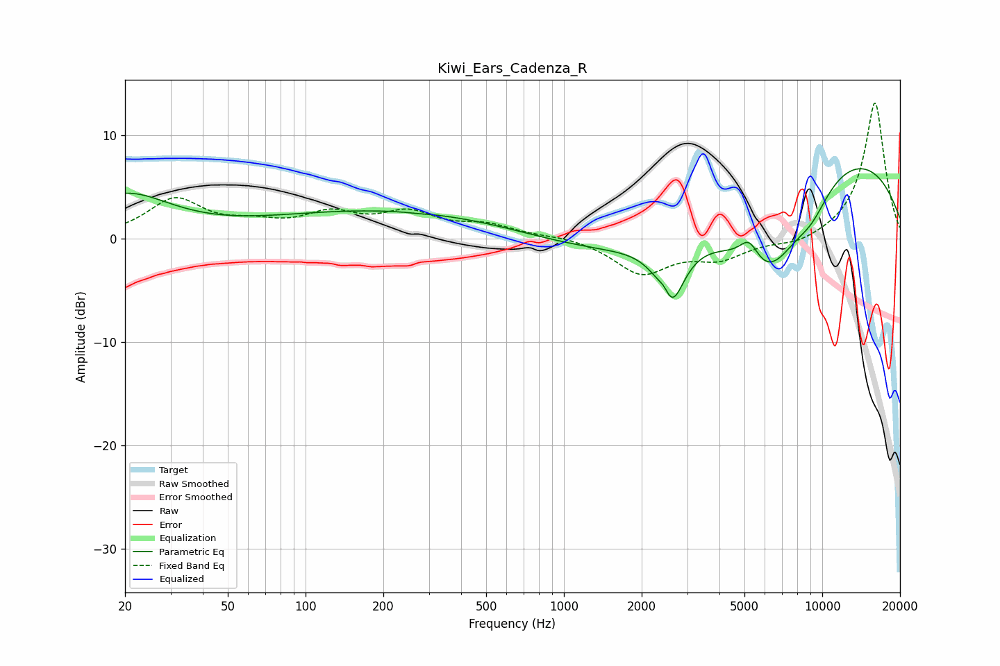

# Kiwi_Ears_Cadenza_R
See [usage instructions](https://github.com/jaakkopasanen/AutoEq#usage) for more options and info.

### Parametric EQs
Apply preamp of -6.8 dB when using parametric equalizer.

|   # | Type    |   Fc (Hz) |    Q |   Gain (dB) |
|-----|---------|-----------|------|-------------|
|   1 | Peaking |        20 | 0.8  |         4.1 |
|   2 | Peaking |       214 | 0.29 |         2.7 |
|   3 | Peaking |       274 | 3.67 |        -0.1 |
|   4 | Peaking |      2460 | 5.37 |         1.8 |
|   5 | Peaking |      2573 | 2.85 |        -6.6 |
|   6 | Peaking |      4021 | 0.22 |        -3.5 |
|   7 | Peaking |      5210 | 3.7  |         2.3 |
|   8 | Peaking |      6207 | 0.99 |        -8.4 |
|   9 | Peaking |      9100 | 1.78 |        -2.3 |
|  10 | Peaking |      9997 | 0.29 |        11   |

### Fixed Band EQs
When using fixed band (also called graphic) equalizer, apply preamp of **-13.2 dB** (if available) and set gains manually with these parameters.

|   # | Type    |   Fc (Hz) |    Q |   Gain (dB) |
|-----|---------|-----------|------|-------------|
|   1 | Peaking |        31 | 1.41 |         3.7 |
|   2 | Peaking |        62 | 1.41 |         1   |
|   3 | Peaking |       125 | 1.41 |         2.1 |
|   4 | Peaking |       250 | 1.41 |         2.2 |
|   5 | Peaking |       500 | 1.41 |         1.1 |
|   6 | Peaking |      1000 | 1.41 |         0.3 |
|   7 | Peaking |      2000 | 1.41 |        -3.3 |
|   8 | Peaking |      4000 | 1.41 |        -1.8 |
|   9 | Peaking |      8000 | 1.41 |        -0.7 |
|  10 | Peaking |     16000 | 1.41 |        13.3 |

### Graphs

