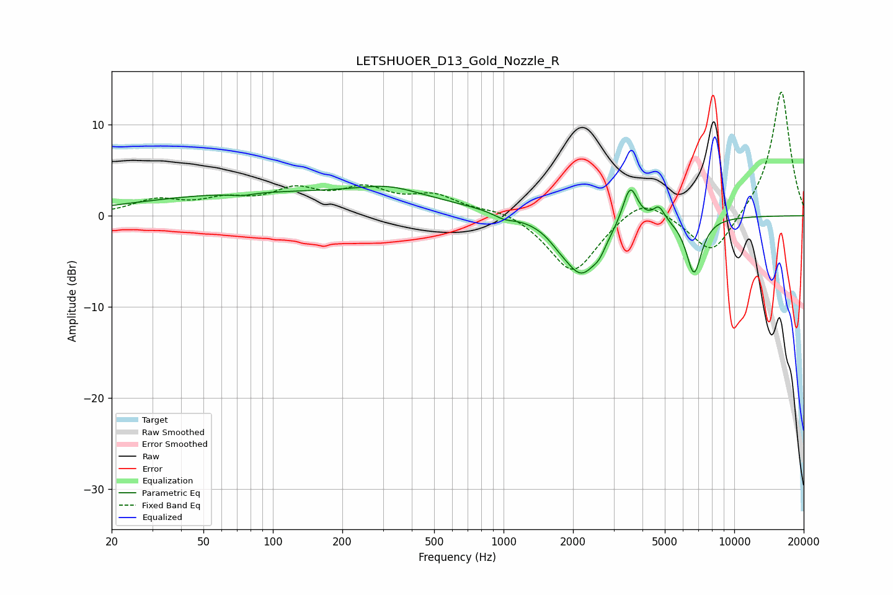

# LETSHUOER_D13_Gold_Nozzle_R
See [usage instructions](https://github.com/jaakkopasanen/AutoEq#usage) for more options and info.

### Parametric EQs
Apply preamp of -3.3 dB when using parametric equalizer.

|   # | Type    |   Fc (Hz) |    Q |   Gain (dB) |
|-----|---------|-----------|------|-------------|
|   1 | Peaking |        73 | 3.01 |        -0.3 |
|   2 | Peaking |       122 | 0.19 |         2.6 |
|   3 | Peaking |       318 | 1.07 |         1.1 |
|   4 | Peaking |      1004 | 3.12 |        -0.6 |
|   5 | Peaking |      1728 | 3.25 |        -0.6 |
|   6 | Peaking |      2174 | 1.76 |        -6.3 |
|   7 | Peaking |      2604 | 5.48 |        -0.9 |
|   8 | Peaking |      3536 | 4.31 |         4.4 |
|   9 | Peaking |      4715 | 5.66 |         1.6 |
|  10 | Peaking |      6691 | 4.01 |        -6.2 |

### Fixed Band EQs
When using fixed band (also called graphic) equalizer, apply preamp of **-13.7 dB** (if available) and set gains manually with these parameters.

|   # | Type    |   Fc (Hz) |    Q |   Gain (dB) |
|-----|---------|-----------|------|-------------|
|   1 | Peaking |        31 | 1.41 |         1.6 |
|   2 | Peaking |        62 | 1.41 |         1.4 |
|   3 | Peaking |       125 | 1.41 |         2.4 |
|   4 | Peaking |       250 | 1.41 |         2.5 |
|   5 | Peaking |       500 | 1.41 |         2   |
|   6 | Peaking |      1000 | 1.41 |         0.8 |
|   7 | Peaking |      2000 | 1.41 |        -6.4 |
|   8 | Peaking |      4000 | 1.41 |         2.4 |
|   9 | Peaking |      8000 | 1.41 |        -4.6 |
|  10 | Peaking |     16000 | 1.41 |        13.9 |

### Graphs

