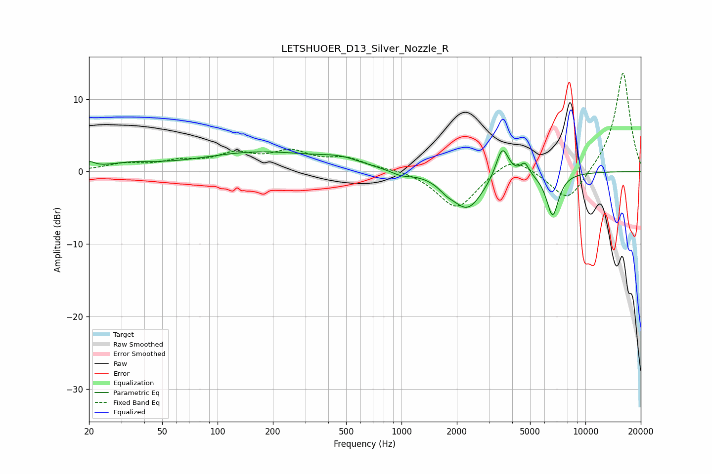

# LETSHUOER_D13_Silver_Nozzle_R
See [usage instructions](https://github.com/jaakkopasanen/AutoEq#usage) for more options and info.

### Parametric EQs
Apply preamp of -3.0 dB when using parametric equalizer.

|   # | Type    |   Fc (Hz) |    Q |   Gain (dB) |
|-----|---------|-----------|------|-------------|
|   1 | Peaking |        20 | 4.87 |         0.8 |
|   2 | Peaking |        33 | 1.04 |         0.8 |
|   3 | Peaking |       172 | 0.42 |         2.6 |
|   4 | Peaking |       465 | 1.28 |         0.9 |
|   5 | Peaking |       993 | 2.61 |        -0.6 |
|   6 | Peaking |      1751 | 3.33 |        -0.8 |
|   7 | Peaking |      2283 | 1.64 |        -5.1 |
|   8 | Peaking |      3532 | 4.03 |         4.5 |
|   9 | Peaking |      4682 | 5.94 |         1.7 |
|  10 | Peaking |      6629 | 4.06 |        -5.9 |

### Fixed Band EQs
When using fixed band (also called graphic) equalizer, apply preamp of **-13.7 dB** (if available) and set gains manually with these parameters.

|   # | Type    |   Fc (Hz) |    Q |   Gain (dB) |
|-----|---------|-----------|------|-------------|
|   1 | Peaking |        31 | 1.41 |         0.9 |
|   2 | Peaking |        62 | 1.41 |         1.2 |
|   3 | Peaking |       125 | 1.41 |         2.1 |
|   4 | Peaking |       250 | 1.41 |         2.4 |
|   5 | Peaking |       500 | 1.41 |         1.6 |
|   6 | Peaking |      1000 | 1.41 |         0.4 |
|   7 | Peaking |      2000 | 1.41 |        -5.2 |
|   8 | Peaking |      4000 | 1.41 |         2.4 |
|   9 | Peaking |      8000 | 1.41 |        -4.5 |
|  10 | Peaking |     16000 | 1.41 |        13.9 |

### Graphs

