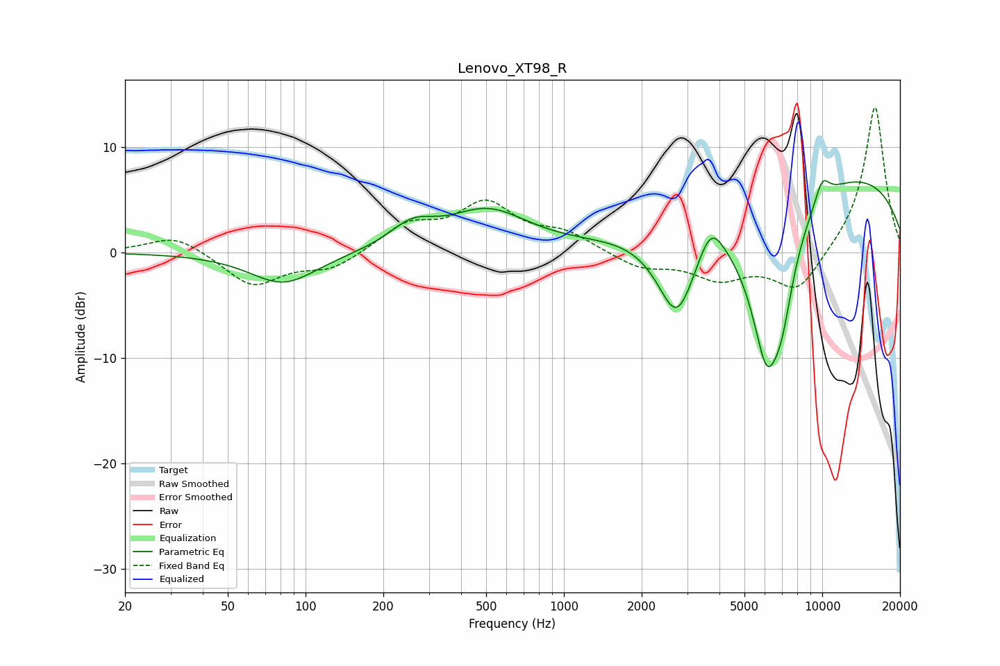

# Lenovo_XT98_R
See [usage instructions](https://github.com/jaakkopasanen/AutoEq#usage) for more options and info.

### Parametric EQs
Apply preamp of -6.9 dB when using parametric equalizer.

|   # | Type    |   Fc (Hz) |    Q |   Gain (dB) |
|-----|---------|-----------|------|-------------|
|   1 | Peaking |        82 | 1.09 |        -3   |
|   2 | Peaking |       259 | 1.61 |         2.1 |
|   3 | Peaking |       510 | 0.98 |         4.2 |
|   4 | Peaking |       521 | 1.44 |        -0.5 |
|   5 | Peaking |      2737 | 1.78 |        -8.8 |
|   6 | Peaking |      3705 | 2.86 |         3.1 |
|   7 | Peaking |      6086 | 1.81 |       -15   |
|   8 | Peaking |      6972 | 3.01 |        -4.9 |
|   9 | Peaking |     10000 | 4.2  |         2.1 |
|  10 | Peaking |     10000 | 0.22 |         8   |

### Fixed Band EQs
When using fixed band (also called graphic) equalizer, apply preamp of **-13.8 dB** (if available) and set gains manually with these parameters.

|   # | Type    |   Fc (Hz) |    Q |   Gain (dB) |
|-----|---------|-----------|------|-------------|
|   1 | Peaking |        31 | 1.41 |         1.7 |
|   2 | Peaking |        62 | 1.41 |        -3.2 |
|   3 | Peaking |       125 | 1.41 |        -1.6 |
|   4 | Peaking |       250 | 1.41 |         2.5 |
|   5 | Peaking |       500 | 1.41 |         4.3 |
|   6 | Peaking |      1000 | 1.41 |         1.6 |
|   7 | Peaking |      2000 | 1.41 |        -1.4 |
|   8 | Peaking |      4000 | 1.41 |        -2.3 |
|   9 | Peaking |      8000 | 1.41 |        -3.8 |
|  10 | Peaking |     16000 | 1.41 |        14   |

### Graphs

