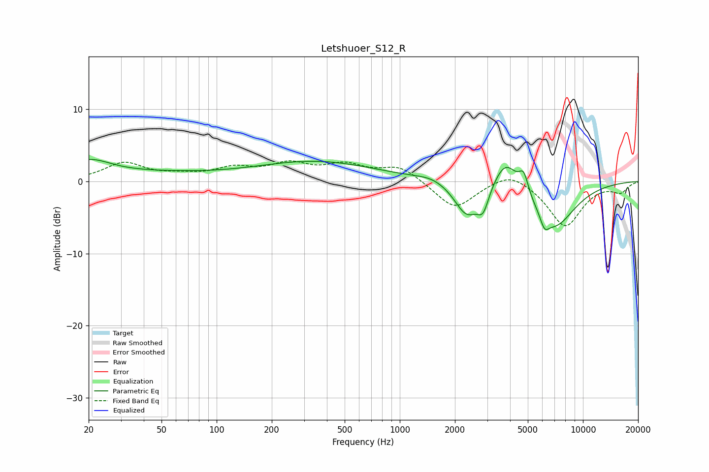

# Letshuoer_S12_R
See [usage instructions](https://github.com/jaakkopasanen/AutoEq#usage) for more options and info.

### Parametric EQs
Apply preamp of -3.1 dB when using parametric equalizer.

|   # | Type    |   Fc (Hz) |    Q |   Gain (dB) |
|-----|---------|-----------|------|-------------|
|   1 | Peaking |        20 | 1.19 |         2.4 |
|   2 | Peaking |        45 | 0.44 |         0.9 |
|   3 | Peaking |       348 | 0.43 |         2.7 |
|   4 | Peaking |      1499 | 1.74 |         0.6 |
|   5 | Peaking |      2320 | 2.08 |        -4.6 |
|   6 | Peaking |      2852 | 4.48 |        -3   |
|   7 | Peaking |      3787 | 2.11 |         4.3 |
|   8 | Peaking |      4748 | 5.64 |         2.7 |
|   9 | Peaking |      6167 | 5.8  |        -1.8 |
|  10 | Peaking |      6983 | 1.18 |        -6.2 |

### Fixed Band EQs
When using fixed band (also called graphic) equalizer, apply preamp of **-2.9 dB** (if available) and set gains manually with these parameters.

|   # | Type    |   Fc (Hz) |    Q |   Gain (dB) |
|-----|---------|-----------|------|-------------|
|   1 | Peaking |        31 | 1.41 |         2.5 |
|   2 | Peaking |        62 | 1.41 |         0.6 |
|   3 | Peaking |       125 | 1.41 |         1.6 |
|   4 | Peaking |       250 | 1.41 |         2.1 |
|   5 | Peaking |       500 | 1.41 |         2   |
|   6 | Peaking |      1000 | 1.41 |         2.1 |
|   7 | Peaking |      2000 | 1.41 |        -3.9 |
|   8 | Peaking |      4000 | 1.41 |         1.7 |
|   9 | Peaking |      8000 | 1.41 |        -6.2 |
|  10 | Peaking |     16000 | 1.41 |        -1.4 |

### Graphs

