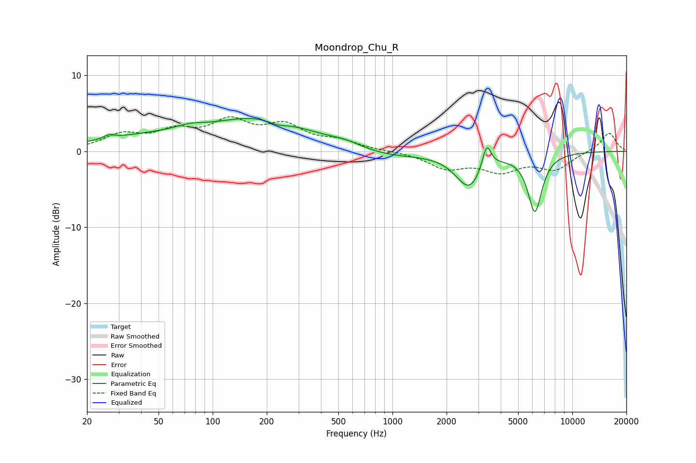

# Moondrop_Chu_R
See [usage instructions](https://github.com/jaakkopasanen/AutoEq#usage) for more options and info.

### Parametric EQs
Apply preamp of -4.4 dB when using parametric equalizer.

|   # | Type    |   Fc (Hz) |    Q |   Gain (dB) |
|-----|---------|-----------|------|-------------|
|   1 | Peaking |        27 | 5.23 |         0.5 |
|   2 | Peaking |        40 | 0.48 |         1.6 |
|   3 | Peaking |        75 | 1.78 |         0.6 |
|   4 | Peaking |       186 | 0.51 |         4.1 |
|   5 | Peaking |       230 | 2.48 |        -0.6 |
|   6 | Peaking |       551 | 1.47 |         0.7 |
|   7 | Peaking |       906 | 0.69 |        -0.9 |
|   8 | Peaking |      2675 | 1.89 |        -4.6 |
|   9 | Peaking |      3342 | 5.64 |         3.4 |
|  10 | Peaking |      6195 | 3.48 |        -7.7 |

### Fixed Band EQs
When using fixed band (also called graphic) equalizer, apply preamp of **-4.6 dB** (if available) and set gains manually with these parameters.

|   # | Type    |   Fc (Hz) |    Q |   Gain (dB) |
|-----|---------|-----------|------|-------------|
|   1 | Peaking |        31 | 1.41 |         2   |
|   2 | Peaking |        62 | 1.41 |         2.2 |
|   3 | Peaking |       125 | 1.41 |         3.5 |
|   4 | Peaking |       250 | 1.41 |         3   |
|   5 | Peaking |       500 | 1.41 |         1.2 |
|   6 | Peaking |      1000 | 1.41 |         0   |
|   7 | Peaking |      2000 | 1.41 |        -2.1 |
|   8 | Peaking |      4000 | 1.41 |        -2.3 |
|   9 | Peaking |      8000 | 1.41 |        -2.2 |
|  10 | Peaking |     16000 | 1.41 |         2.5 |

### Graphs

