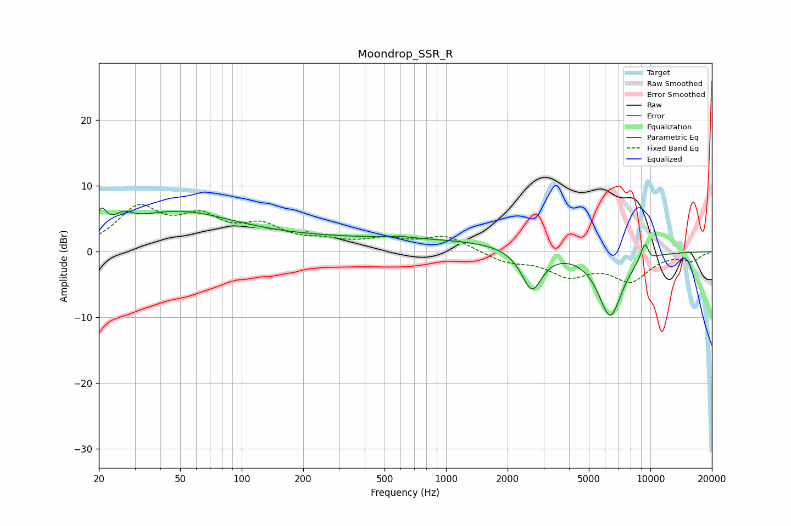

# Moondrop_SSR_R
See [usage instructions](https://github.com/jaakkopasanen/AutoEq#usage) for more options and info.

### Parametric EQs
Apply preamp of -6.7 dB when using parametric equalizer.

|   # | Type    |   Fc (Hz) |    Q |   Gain (dB) |
|-----|---------|-----------|------|-------------|
|   1 | Peaking |        21 | 5.93 |         3   |
|   2 | Peaking |        26 | 3.17 |         1.6 |
|   3 | Peaking |        47 | 0.5  |         5.6 |
|   4 | Peaking |       518 | 0.18 |         2   |
|   5 | Peaking |       594 | 2.68 |         0.3 |
|   6 | Peaking |      2630 | 2.77 |        -6.3 |
|   7 | Peaking |      6328 | 2.25 |        -9.1 |
|   8 | Peaking |      6649 | 2.69 |        -0.8 |
|   9 | Peaking |      9395 | 5.87 |         2.9 |
|  10 | Peaking |     10000 | 5.98 |        -0.5 |

### Fixed Band EQs
When using fixed band (also called graphic) equalizer, apply preamp of **-7.3 dB** (if available) and set gains manually with these parameters.

|   # | Type    |   Fc (Hz) |    Q |   Gain (dB) |
|-----|---------|-----------|------|-------------|
|   1 | Peaking |        31 | 1.41 |         6.2 |
|   2 | Peaking |        62 | 1.41 |         4.4 |
|   3 | Peaking |       125 | 1.41 |         3.3 |
|   4 | Peaking |       250 | 1.41 |         1.2 |
|   5 | Peaking |       500 | 1.41 |         1.6 |
|   6 | Peaking |      1000 | 1.41 |         2.3 |
|   7 | Peaking |      2000 | 1.41 |        -1.5 |
|   8 | Peaking |      4000 | 1.41 |        -3.3 |
|   9 | Peaking |      8000 | 1.41 |        -4.1 |
|  10 | Peaking |     16000 | 1.41 |        -1.3 |

### Graphs

