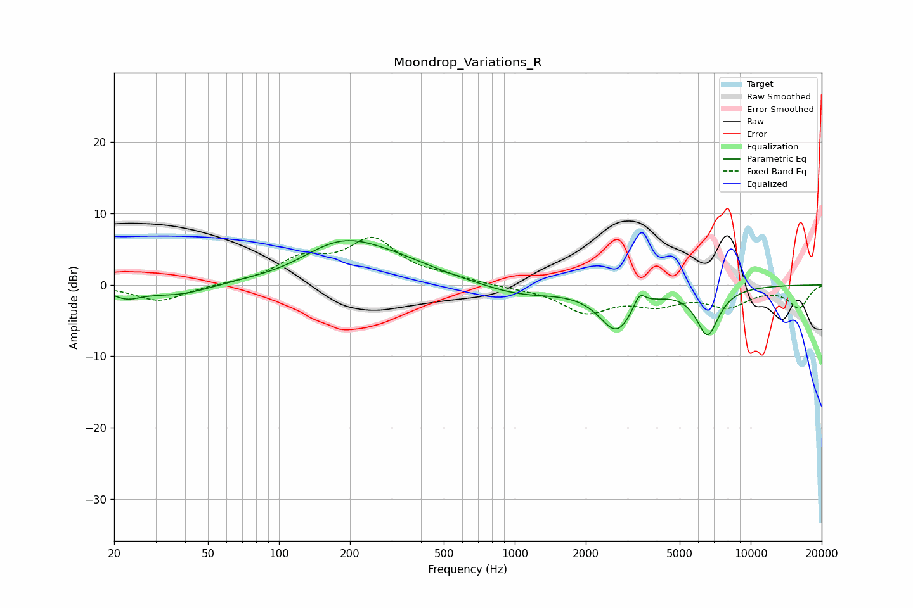

# Moondrop_Variations_R
See [usage instructions](https://github.com/jaakkopasanen/AutoEq#usage) for more options and info.

### Parametric EQs
Apply preamp of -6.3 dB when using parametric equalizer.

|   # | Type    |   Fc (Hz) |    Q |   Gain (dB) |
|-----|---------|-----------|------|-------------|
|   1 | Peaking |        23 | 2.33 |        -1.4 |
|   2 | Peaking |        37 | 0.99 |        -1.6 |
|   3 | Peaking |       108 | 1.11 |        -0.6 |
|   4 | Peaking |       186 | 0.72 |         5.9 |
|   5 | Peaking |       331 | 0.89 |         1.2 |
|   6 | Peaking |       595 | 0.83 |         0.2 |
|   7 | Peaking |      1039 | 0.85 |        -1.5 |
|   8 | Peaking |      2698 | 1.92 |        -6   |
|   9 | Peaking |      3376 | 5.51 |         2.2 |
|  10 | Peaking |      6558 | 2.83 |        -6.6 |

### Fixed Band EQs
When using fixed band (also called graphic) equalizer, apply preamp of **-6.8 dB** (if available) and set gains manually with these parameters.

|   # | Type    |   Fc (Hz) |    Q |   Gain (dB) |
|-----|---------|-----------|------|-------------|
|   1 | Peaking |        31 | 1.41 |        -2.3 |
|   2 | Peaking |        62 | 1.41 |         0.1 |
|   3 | Peaking |       125 | 1.41 |         3.3 |
|   4 | Peaking |       250 | 1.41 |         6   |
|   5 | Peaking |       500 | 1.41 |         0.8 |
|   6 | Peaking |      1000 | 1.41 |        -0.3 |
|   7 | Peaking |      2000 | 1.41 |        -3.6 |
|   8 | Peaking |      4000 | 1.41 |        -2.3 |
|   9 | Peaking |      8000 | 1.41 |        -2.7 |
|  10 | Peaking |     16000 | 1.41 |        -3.1 |

### Graphs

