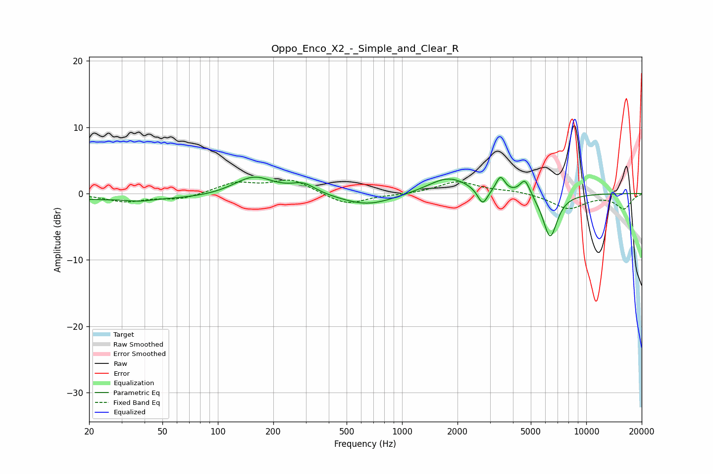

# Oppo_Enco_X2_-_Simple_and_Clear_R
See [usage instructions](https://github.com/jaakkopasanen/AutoEq#usage) for more options and info.

### Parametric EQs
Apply preamp of -2.6 dB when using parametric equalizer.

|   # | Type    |   Fc (Hz) |    Q |   Gain (dB) |
|-----|---------|-----------|------|-------------|
|   1 | Peaking |        37 | 2.29 |        -0.3 |
|   2 | Peaking |        39 | 0.18 |        -1   |
|   3 | Peaking |       156 | 1.25 |         3   |
|   4 | Peaking |       292 | 2.14 |         1.5 |
|   5 | Peaking |       651 | 0.99 |        -1.8 |
|   6 | Peaking |      1789 | 1.26 |         2.6 |
|   7 | Peaking |      2739 | 5.19 |        -2.5 |
|   8 | Peaking |      3422 | 5.93 |         2.3 |
|   9 | Peaking |      4653 | 4.98 |         2.5 |
|  10 | Peaking |      6365 | 3.46 |        -6.7 |

### Fixed Band EQs
When using fixed band (also called graphic) equalizer, apply preamp of **-2.1 dB** (if available) and set gains manually with these parameters.

|   # | Type    |   Fc (Hz) |    Q |   Gain (dB) |
|-----|---------|-----------|------|-------------|
|   1 | Peaking |        31 | 1.41 |        -1.2 |
|   2 | Peaking |        62 | 1.41 |        -0.9 |
|   3 | Peaking |       125 | 1.41 |         1.6 |
|   4 | Peaking |       250 | 1.41 |         2.1 |
|   5 | Peaking |       500 | 1.41 |        -1.8 |
|   6 | Peaking |      1000 | 1.41 |        -0.2 |
|   7 | Peaking |      2000 | 1.41 |         1.8 |
|   8 | Peaking |      4000 | 1.41 |         0.4 |
|   9 | Peaking |      8000 | 1.41 |        -2.3 |
|  10 | Peaking |     16000 | 1.41 |        -2.2 |

### Graphs

