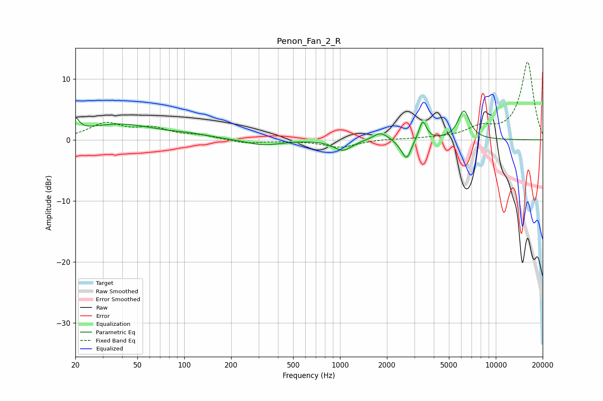

# Penon_Fan_2_R
See [usage instructions](https://github.com/jaakkopasanen/AutoEq#usage) for more options and info.

### Parametric EQs
Apply preamp of -4.8 dB when using parametric equalizer.

|   # | Type    |   Fc (Hz) |    Q |   Gain (dB) |
|-----|---------|-----------|------|-------------|
|   1 | Peaking |        20 | 5.95 |         2.1 |
|   2 | Peaking |        38 | 0.59 |         2.5 |
|   3 | Peaking |       111 | 1.16 |         0.5 |
|   4 | Peaking |       322 | 1.29 |        -0.9 |
|   5 | Peaking |      1042 | 2.48 |        -1.7 |
|   6 | Peaking |      1826 | 2.92 |         1.4 |
|   7 | Peaking |      2517 | 3.71 |        -0.8 |
|   8 | Peaking |      2689 | 5.06 |        -2.8 |
|   9 | Peaking |      3394 | 5.95 |         3.2 |
|  10 | Peaking |      6239 | 3.63 |         4.7 |

### Fixed Band EQs
When using fixed band (also called graphic) equalizer, apply preamp of **-12.8 dB** (if available) and set gains manually with these parameters.

|   # | Type    |   Fc (Hz) |    Q |   Gain (dB) |
|-----|---------|-----------|------|-------------|
|   1 | Peaking |        31 | 1.41 |         2.5 |
|   2 | Peaking |        62 | 1.41 |         1.7 |
|   3 | Peaking |       125 | 1.41 |         0.6 |
|   4 | Peaking |       250 | 1.41 |        -0.6 |
|   5 | Peaking |       500 | 1.41 |        -0.1 |
|   6 | Peaking |      1000 | 1.41 |        -1.2 |
|   7 | Peaking |      2000 | 1.41 |         0.1 |
|   8 | Peaking |      4000 | 1.41 |         0.2 |
|   9 | Peaking |      8000 | 1.41 |         1.8 |
|  10 | Peaking |     16000 | 1.41 |        12.8 |

### Graphs

