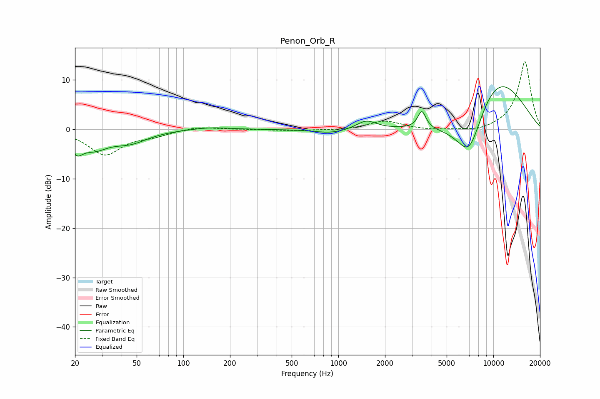

# Penon_Orb_R
See [usage instructions](https://github.com/jaakkopasanen/AutoEq#usage) for more options and info.

### Parametric EQs
Apply preamp of -8.7 dB when using parametric equalizer.

|   # | Type    |   Fc (Hz) |    Q |   Gain (dB) |
|-----|---------|-----------|------|-------------|
|   1 | Peaking |        21 | 3.69 |        -3   |
|   2 | Peaking |        27 | 1.54 |        -3.2 |
|   3 | Peaking |        45 | 1.23 |        -2.3 |
|   4 | Peaking |       150 | 1.19 |         0.5 |
|   5 | Peaking |       904 | 1.31 |        -0.8 |
|   6 | Peaking |      1515 | 2.22 |         1.8 |
|   7 | Peaking |      3457 | 5.43 |         3.5 |
|   8 | Peaking |      6997 | 1.06 |       -15.8 |
|   9 | Peaking |      9398 | 0.57 |         7   |
|  10 | Peaking |      9792 | 0.53 |         8.3 |

### Fixed Band EQs
When using fixed band (also called graphic) equalizer, apply preamp of **-13.8 dB** (if available) and set gains manually with these parameters.

|   # | Type    |   Fc (Hz) |    Q |   Gain (dB) |
|-----|---------|-----------|------|-------------|
|   1 | Peaking |        31 | 1.41 |        -5   |
|   2 | Peaking |        62 | 1.41 |        -1   |
|   3 | Peaking |       125 | 1.41 |         0.6 |
|   4 | Peaking |       250 | 1.41 |         0   |
|   5 | Peaking |       500 | 1.41 |        -0.3 |
|   6 | Peaking |      1000 | 1.41 |        -0.2 |
|   7 | Peaking |      2000 | 1.41 |         1.7 |
|   8 | Peaking |      4000 | 1.41 |        -0.3 |
|   9 | Peaking |      8000 | 1.41 |        -0.6 |
|  10 | Peaking |     16000 | 1.41 |        13.8 |

### Graphs

