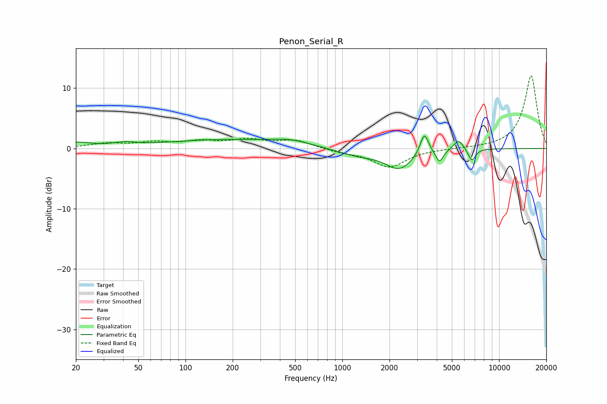

# Penon_Serial_R
See [usage instructions](https://github.com/jaakkopasanen/AutoEq#usage) for more options and info.

### Parametric EQs
Apply preamp of -2.1 dB when using parametric equalizer.

|   # | Type    |   Fc (Hz) |    Q |   Gain (dB) |
|-----|---------|-----------|------|-------------|
|   1 | Peaking |        20 | 1.52 |         0.9 |
|   2 | Peaking |        41 | 1.97 |         0.6 |
|   3 | Peaking |       177 | 0.36 |         1.4 |
|   4 | Peaking |       471 | 1.2  |         0.8 |
|   5 | Peaking |      1253 | 1.1  |        -1.1 |
|   6 | Peaking |      2311 | 1.58 |        -3.2 |
|   7 | Peaking |      3337 | 5.23 |         3.6 |
|   8 | Peaking |      4167 | 6    |        -2.1 |
|   9 | Peaking |      5510 | 4.4  |         1.7 |
|  10 | Peaking |      6708 | 6    |        -2.1 |

### Fixed Band EQs
When using fixed band (also called graphic) equalizer, apply preamp of **-12.1 dB** (if available) and set gains manually with these parameters.

|   # | Type    |   Fc (Hz) |    Q |   Gain (dB) |
|-----|---------|-----------|------|-------------|
|   1 | Peaking |        31 | 1.41 |         0.7 |
|   2 | Peaking |        62 | 1.41 |         0.9 |
|   3 | Peaking |       125 | 1.41 |         1   |
|   4 | Peaking |       250 | 1.41 |         1.3 |
|   5 | Peaking |       500 | 1.41 |         1.3 |
|   6 | Peaking |      1000 | 1.41 |        -0.5 |
|   7 | Peaking |      2000 | 1.41 |        -3   |
|   8 | Peaking |      4000 | 1.41 |        -0.1 |
|   9 | Peaking |      8000 | 1.41 |         0   |
|  10 | Peaking |     16000 | 1.41 |        12.1 |

### Graphs

