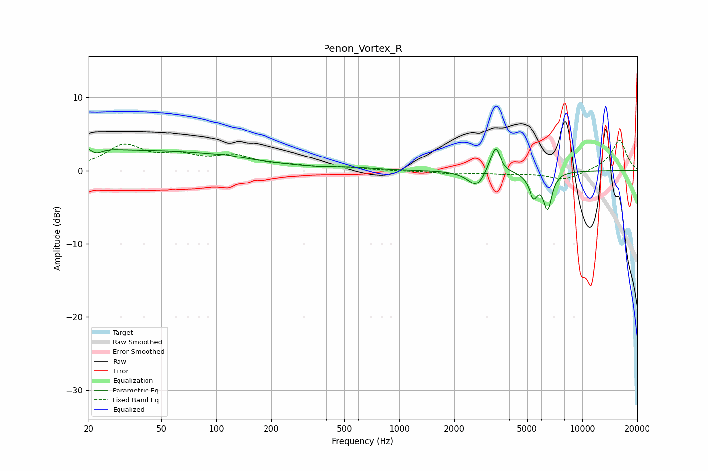

# Penon_Vortex_R
See [usage instructions](https://github.com/jaakkopasanen/AutoEq#usage) for more options and info.

### Parametric EQs
Apply preamp of -3.1 dB when using parametric equalizer.

|   # | Type    |   Fc (Hz) |    Q |   Gain (dB) |
|-----|---------|-----------|------|-------------|
|   1 | Peaking |        20 | 1.72 |         2.3 |
|   2 | Peaking |        22 | 3.45 |        -1.7 |
|   3 | Peaking |        49 | 0.29 |         2.6 |
|   4 | Peaking |       113 | 2.6  |         0.1 |
|   5 | Peaking |       561 | 1.34 |         0.3 |
|   6 | Peaking |      2657 | 2.9  |        -2.3 |
|   7 | Peaking |      3145 | 4.61 |         0.9 |
|   8 | Peaking |      3374 | 5.96 |         3.2 |
|   9 | Peaking |      5420 | 5.64 |        -3.2 |
|  10 | Peaking |      6473 | 6    |        -4.9 |

### Fixed Band EQs
When using fixed band (also called graphic) equalizer, apply preamp of **-4.2 dB** (if available) and set gains manually with these parameters.

|   # | Type    |   Fc (Hz) |    Q |   Gain (dB) |
|-----|---------|-----------|------|-------------|
|   1 | Peaking |        31 | 1.41 |         3.2 |
|   2 | Peaking |        62 | 1.41 |         1.6 |
|   3 | Peaking |       125 | 1.41 |         1.8 |
|   4 | Peaking |       250 | 1.41 |         0.5 |
|   5 | Peaking |       500 | 1.41 |         0.3 |
|   6 | Peaking |      1000 | 1.41 |        -0   |
|   7 | Peaking |      2000 | 1.41 |        -0.4 |
|   8 | Peaking |      4000 | 1.41 |        -0.4 |
|   9 | Peaking |      8000 | 1.41 |        -1.2 |
|  10 | Peaking |     16000 | 1.41 |         4.2 |

### Graphs

