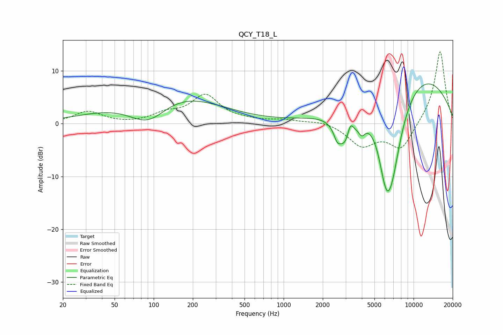

# QCY_T18_L
See [usage instructions](https://github.com/jaakkopasanen/AutoEq#usage) for more options and info.

### Parametric EQs
Apply preamp of -7.6 dB when using parametric equalizer.

|   # | Type    |   Fc (Hz) |    Q |   Gain (dB) |
|-----|---------|-----------|------|-------------|
|   1 | Peaking |        91 | 0.8  |        -7.5 |
|   2 | Peaking |       112 | 0.38 |         8.5 |
|   3 | Peaking |      2581 | 5.62 |        -2   |
|   4 | Peaking |      3011 | 2.32 |        -6.7 |
|   5 | Peaking |      3256 | 5.6  |         3.4 |
|   6 | Peaking |      3999 | 5.53 |        -1.9 |
|   7 | Peaking |      5741 | 5.96 |        -0.6 |
|   8 | Peaking |      6213 | 2.49 |        -9.4 |
|   9 | Peaking |      6849 | 1.43 |       -13.3 |
|  10 | Peaking |      9707 | 0.32 |        10.7 |

### Fixed Band EQs
When using fixed band (also called graphic) equalizer, apply preamp of **-13.7 dB** (if available) and set gains manually with these parameters.

|   # | Type    |   Fc (Hz) |    Q |   Gain (dB) |
|-----|---------|-----------|------|-------------|
|   1 | Peaking |        31 | 1.41 |         2.3 |
|   2 | Peaking |        62 | 1.41 |        -0.1 |
|   3 | Peaking |       125 | 1.41 |         1.6 |
|   4 | Peaking |       250 | 1.41 |         5.2 |
|   5 | Peaking |       500 | 1.41 |         0.4 |
|   6 | Peaking |      1000 | 1.41 |         0.6 |
|   7 | Peaking |      2000 | 1.41 |         0.6 |
|   8 | Peaking |      4000 | 1.41 |        -4   |
|   9 | Peaking |      8000 | 1.41 |        -4.9 |
|  10 | Peaking |     16000 | 1.41 |        14   |

### Graphs

