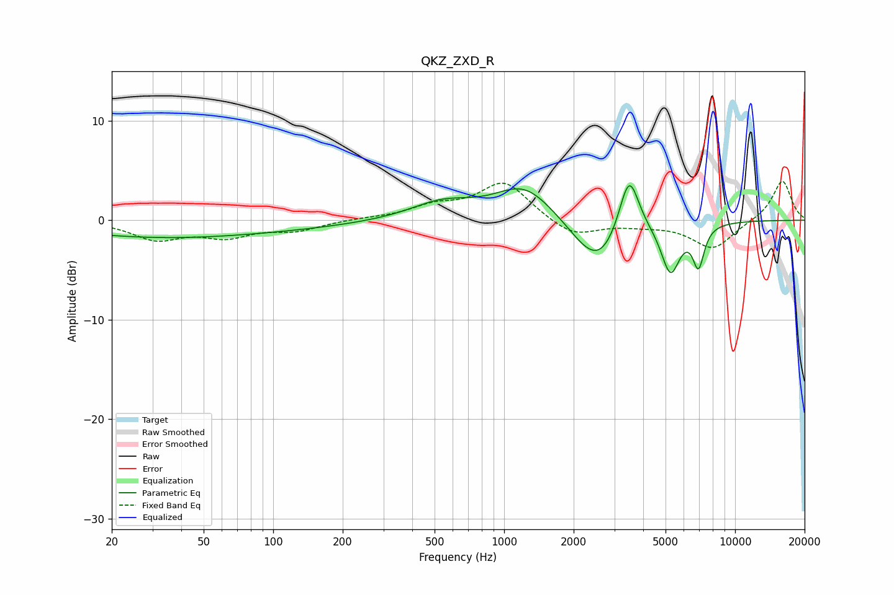

# QKZ_ZXD_R
See [usage instructions](https://github.com/jaakkopasanen/AutoEq#usage) for more options and info.

### Parametric EQs
Apply preamp of -3.6 dB when using parametric equalizer.

|   # | Type    |   Fc (Hz) |    Q |   Gain (dB) |
|-----|---------|-----------|------|-------------|
|   1 | Peaking |        21 | 0.36 |        -1   |
|   2 | Peaking |        69 | 0.32 |        -1.1 |
|   3 | Peaking |       538 | 1.03 |         1.7 |
|   4 | Peaking |      1224 | 1.13 |         3.4 |
|   5 | Peaking |      2249 | 1.46 |        -1.1 |
|   6 | Peaking |      2624 | 1.45 |        -3.9 |
|   7 | Peaking |      3355 | 2.84 |         0.8 |
|   8 | Peaking |      3484 | 3.32 |         5.5 |
|   9 | Peaking |      5252 | 3.43 |        -5   |
|  10 | Peaking |      6945 | 5.58 |        -4   |

### Fixed Band EQs
When using fixed band (also called graphic) equalizer, apply preamp of **-4.0 dB** (if available) and set gains manually with these parameters.

|   # | Type    |   Fc (Hz) |    Q |   Gain (dB) |
|-----|---------|-----------|------|-------------|
|   1 | Peaking |        31 | 1.41 |        -1.8 |
|   2 | Peaking |        62 | 1.41 |        -1.5 |
|   3 | Peaking |       125 | 1.41 |        -0.9 |
|   4 | Peaking |       250 | 1.41 |         0.1 |
|   5 | Peaking |       500 | 1.41 |         1.2 |
|   6 | Peaking |      1000 | 1.41 |         3.8 |
|   7 | Peaking |      2000 | 1.41 |        -1.7 |
|   8 | Peaking |      4000 | 1.41 |        -0.4 |
|   9 | Peaking |      8000 | 1.41 |        -2.9 |
|  10 | Peaking |     16000 | 1.41 |         4.1 |

### Graphs

