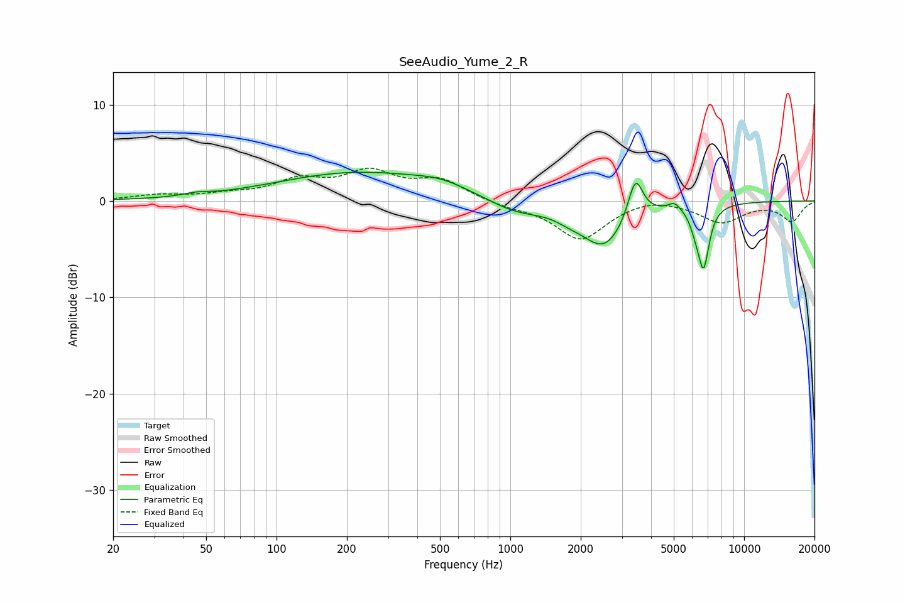

# SeeAudio_Yume_2_R
See [usage instructions](https://github.com/jaakkopasanen/AutoEq#usage) for more options and info.

### Parametric EQs
Apply preamp of -3.1 dB when using parametric equalizer.

|   # | Type    |   Fc (Hz) |    Q |   Gain (dB) |
|-----|---------|-----------|------|-------------|
|   1 | Peaking |        46 | 2.73 |         0.3 |
|   2 | Peaking |       224 | 0.4  |         2.9 |
|   3 | Peaking |       508 | 1.26 |         0.8 |
|   4 | Peaking |      1057 | 1.14 |        -1.4 |
|   5 | Peaking |      1778 | 2.42 |        -0.5 |
|   6 | Peaking |      2514 | 1.47 |        -4.7 |
|   7 | Peaking |      3428 | 4.39 |         4.4 |
|   8 | Peaking |      5039 | 5.45 |         0.8 |
|   9 | Peaking |      6181 | 6    |        -1.2 |
|  10 | Peaking |      6706 | 5.6  |        -6.3 |

### Fixed Band EQs
When using fixed band (also called graphic) equalizer, apply preamp of **-3.5 dB** (if available) and set gains manually with these parameters.

|   # | Type    |   Fc (Hz) |    Q |   Gain (dB) |
|-----|---------|-----------|------|-------------|
|   1 | Peaking |        31 | 1.41 |         0.5 |
|   2 | Peaking |        62 | 1.41 |         0.5 |
|   3 | Peaking |       125 | 1.41 |         1.9 |
|   4 | Peaking |       250 | 1.41 |         2.7 |
|   5 | Peaking |       500 | 1.41 |         2   |
|   6 | Peaking |      1000 | 1.41 |        -0.5 |
|   7 | Peaking |      2000 | 1.41 |        -4   |
|   8 | Peaking |      4000 | 1.41 |         0.6 |
|   9 | Peaking |      8000 | 1.41 |        -2.1 |
|  10 | Peaking |     16000 | 1.41 |        -2.1 |

### Graphs

