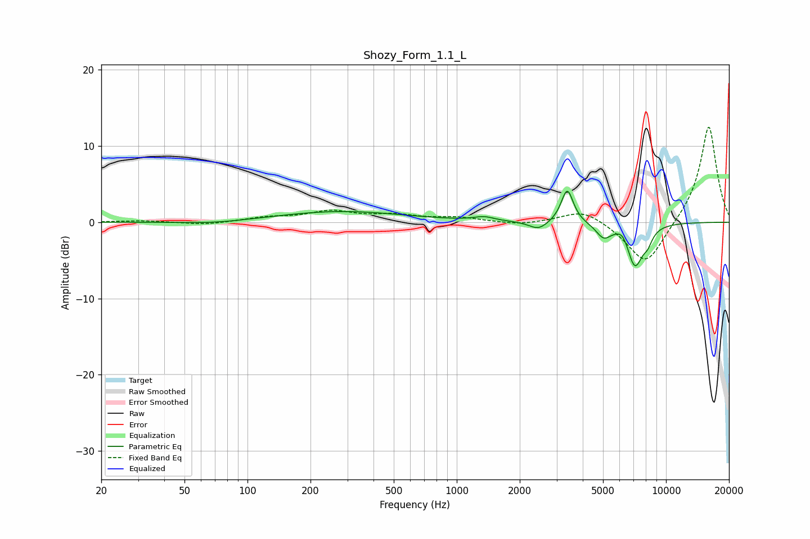

# Shozy_Form_1.1_L
See [usage instructions](https://github.com/jaakkopasanen/AutoEq#usage) for more options and info.

### Parametric EQs
Apply preamp of -4.2 dB when using parametric equalizer.

|   # | Type    |   Fc (Hz) |    Q |   Gain (dB) |
|-----|---------|-----------|------|-------------|
|   1 | Peaking |        70 | 0.93 |        -0.3 |
|   2 | Peaking |       280 | 0.47 |         1.4 |
|   3 | Peaking |      1350 | 2.95 |         0.5 |
|   4 | Peaking |      2458 | 3.18 |        -1.1 |
|   5 | Peaking |      3373 | 5.19 |         3.7 |
|   6 | Peaking |      3377 | 3.52 |         0.8 |
|   7 | Peaking |      5030 | 3.89 |        -1.8 |
|   8 | Peaking |      6220 | 5.01 |         1   |
|   9 | Peaking |      7102 | 3.49 |        -5.6 |
|  10 | Peaking |      8171 | 5.82 |        -1.3 |

### Fixed Band EQs
When using fixed band (also called graphic) equalizer, apply preamp of **-12.6 dB** (if available) and set gains manually with these parameters.

|   # | Type    |   Fc (Hz) |    Q |   Gain (dB) |
|-----|---------|-----------|------|-------------|
|   1 | Peaking |        31 | 1.41 |         0.2 |
|   2 | Peaking |        62 | 1.41 |        -0.4 |
|   3 | Peaking |       125 | 1.41 |         0.6 |
|   4 | Peaking |       250 | 1.41 |         1.3 |
|   5 | Peaking |       500 | 1.41 |         0.8 |
|   6 | Peaking |      1000 | 1.41 |         0.6 |
|   7 | Peaking |      2000 | 1.41 |        -0.4 |
|   8 | Peaking |      4000 | 1.41 |         1.8 |
|   9 | Peaking |      8000 | 1.41 |        -5.9 |
|  10 | Peaking |     16000 | 1.41 |        12.8 |

### Graphs

