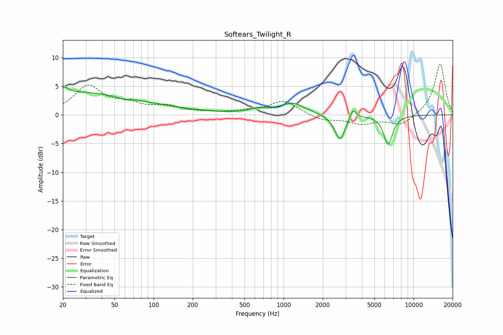

# Softears_Twilight_R
See [usage instructions](https://github.com/jaakkopasanen/AutoEq#usage) for more options and info.

### Parametric EQs
Apply preamp of -5.0 dB when using parametric equalizer.

|   # | Type    |   Fc (Hz) |    Q |   Gain (dB) |
|-----|---------|-----------|------|-------------|
|   1 | Peaking |        20 | 0.26 |         3.1 |
|   2 | Peaking |        20 | 6    |        -2.4 |
|   3 | Peaking |        20 | 5.9  |         3.2 |
|   4 | Peaking |        42 | 0.18 |         0.9 |
|   5 | Peaking |        58 | 3.11 |        -0.4 |
|   6 | Peaking |       636 | 2.11 |         0.8 |
|   7 | Peaking |      1170 | 1.53 |         2   |
|   8 | Peaking |      2711 | 3.51 |        -4.5 |
|   9 | Peaking |      3417 | 6    |         1.8 |
|  10 | Peaking |      6376 | 3.99 |        -5.1 |

### Fixed Band EQs
When using fixed band (also called graphic) equalizer, apply preamp of **-8.9 dB** (if available) and set gains manually with these parameters.

|   # | Type    |   Fc (Hz) |    Q |   Gain (dB) |
|-----|---------|-----------|------|-------------|
|   1 | Peaking |        31 | 1.41 |         4.9 |
|   2 | Peaking |        62 | 1.41 |         1.5 |
|   3 | Peaking |       125 | 1.41 |         1.3 |
|   4 | Peaking |       250 | 1.41 |         0.3 |
|   5 | Peaking |       500 | 1.41 |         0.5 |
|   6 | Peaking |      1000 | 1.41 |         2.4 |
|   7 | Peaking |      2000 | 1.41 |        -1   |
|   8 | Peaking |      4000 | 1.41 |        -1.4 |
|   9 | Peaking |      8000 | 1.41 |        -1.8 |
|  10 | Peaking |     16000 | 1.41 |         9   |

### Graphs

