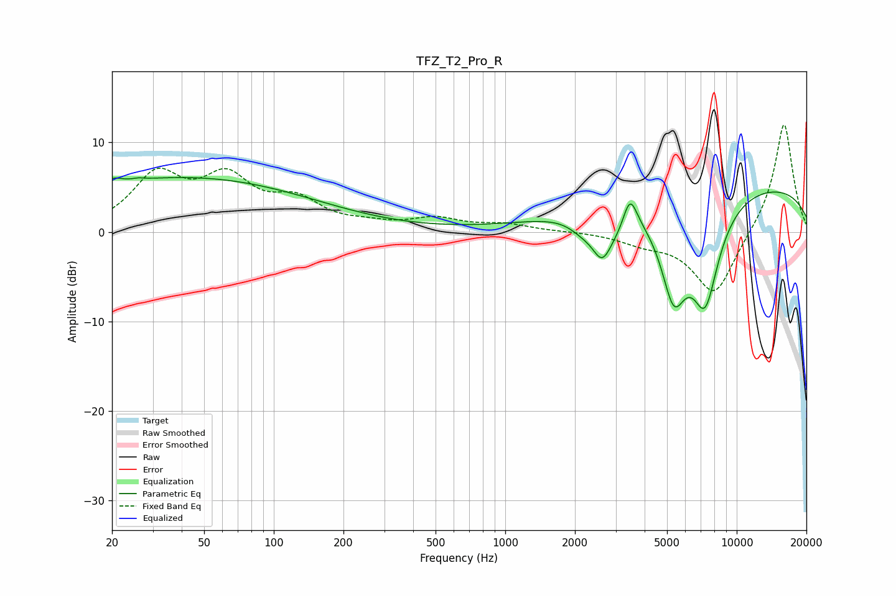

# TFZ_T2_Pro_R
See [usage instructions](https://github.com/jaakkopasanen/AutoEq#usage) for more options and info.

### Parametric EQs
Apply preamp of -6.2 dB when using parametric equalizer.

|   # | Type    |   Fc (Hz) |    Q |   Gain (dB) |
|-----|---------|-----------|------|-------------|
|   1 | Peaking |        20 | 4.22 |         0.7 |
|   2 | Peaking |        26 | 6    |         0.2 |
|   3 | Peaking |        41 | 0.24 |         6.1 |
|   4 | Peaking |      2164 | 2.27 |        -1.4 |
|   5 | Peaking |      2627 | 3.19 |        -4.4 |
|   6 | Peaking |      3138 | 2.88 |        -1.3 |
|   7 | Peaking |      3455 | 4.56 |         3.7 |
|   8 | Peaking |      5345 | 2.35 |        -9.6 |
|   9 | Peaking |      7304 | 2.07 |       -11.2 |
|  10 | Peaking |      9473 | 0.18 |         5.5 |

### Fixed Band EQs
When using fixed band (also called graphic) equalizer, apply preamp of **-12.1 dB** (if available) and set gains manually with these parameters.

|   # | Type    |   Fc (Hz) |    Q |   Gain (dB) |
|-----|---------|-----------|------|-------------|
|   1 | Peaking |        31 | 1.41 |         6   |
|   2 | Peaking |        62 | 1.41 |         5.4 |
|   3 | Peaking |       125 | 1.41 |         3   |
|   4 | Peaking |       250 | 1.41 |         0.6 |
|   5 | Peaking |       500 | 1.41 |         1.3 |
|   6 | Peaking |      1000 | 1.41 |         0.8 |
|   7 | Peaking |      2000 | 1.41 |         0.1 |
|   8 | Peaking |      4000 | 1.41 |        -1   |
|   9 | Peaking |      8000 | 1.41 |        -7.2 |
|  10 | Peaking |     16000 | 1.41 |        12.4 |

### Graphs

