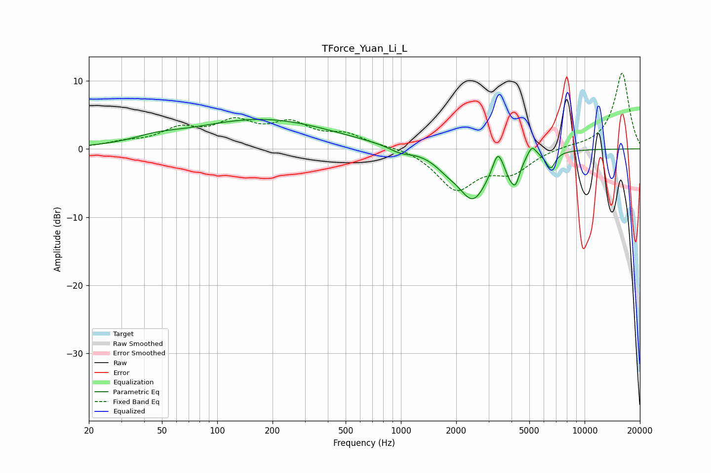

# TForce_Yuan_Li_L
See [usage instructions](https://github.com/jaakkopasanen/AutoEq#usage) for more options and info.

### Parametric EQs
Apply preamp of -4.4 dB when using parametric equalizer.

|   # | Type    |   Fc (Hz) |    Q |   Gain (dB) |
|-----|---------|-----------|------|-------------|
|   1 | Peaking |        47 | 1.12 |         0.9 |
|   2 | Peaking |       175 | 0.37 |         4.3 |
|   3 | Peaking |       990 | 2.44 |        -0.8 |
|   4 | Peaking |      1778 | 2.11 |        -1.2 |
|   5 | Peaking |      2471 | 1.7  |        -7.1 |
|   6 | Peaking |      3365 | 5.35 |         3   |
|   7 | Peaking |      3883 | 6    |        -1.4 |
|   8 | Peaking |      4199 | 5.51 |        -3.5 |
|   9 | Peaking |      5166 | 6    |         1.6 |
|  10 | Peaking |      6530 | 5.33 |        -2.4 |

### Fixed Band EQs
When using fixed band (also called graphic) equalizer, apply preamp of **-11.2 dB** (if available) and set gains manually with these parameters.

|   # | Type    |   Fc (Hz) |    Q |   Gain (dB) |
|-----|---------|-----------|------|-------------|
|   1 | Peaking |        31 | 1.41 |         0.7 |
|   2 | Peaking |        62 | 1.41 |         2.5 |
|   3 | Peaking |       125 | 1.41 |         3.4 |
|   4 | Peaking |       250 | 1.41 |         3.2 |
|   5 | Peaking |       500 | 1.41 |         1.9 |
|   6 | Peaking |      1000 | 1.41 |         0.4 |
|   7 | Peaking |      2000 | 1.41 |        -5.8 |
|   8 | Peaking |      4000 | 1.41 |        -3.1 |
|   9 | Peaking |      8000 | 1.41 |         0.3 |
|  10 | Peaking |     16000 | 1.41 |        11.2 |

### Graphs

