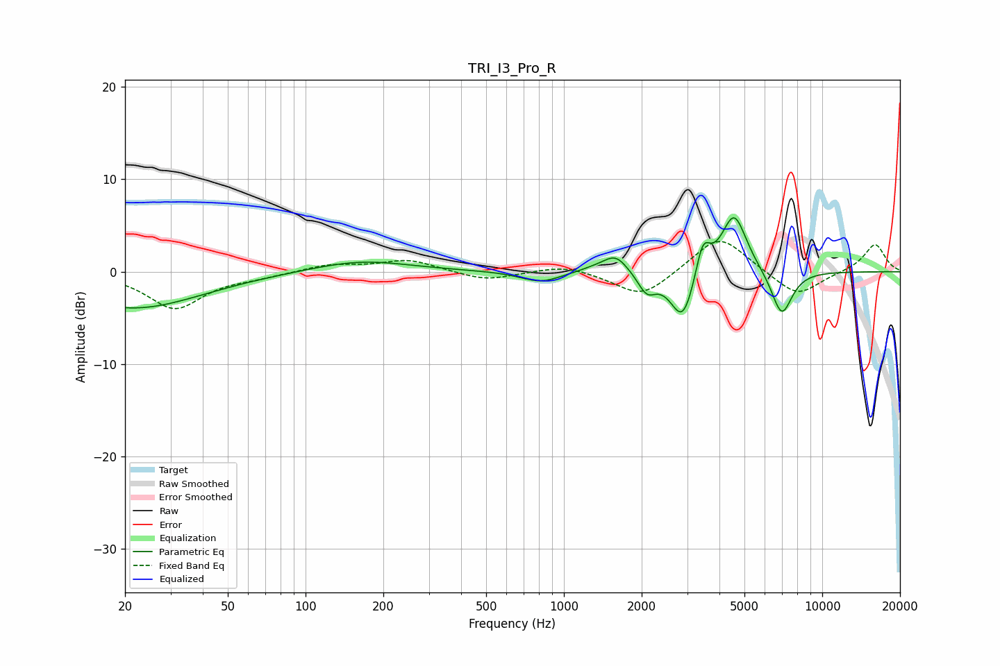

# TRI_I3_Pro_R
See [usage instructions](https://github.com/jaakkopasanen/AutoEq#usage) for more options and info.

### Parametric EQs
Apply preamp of -5.9 dB when using parametric equalizer.

|   # | Type    |   Fc (Hz) |    Q |   Gain (dB) |
|-----|---------|-----------|------|-------------|
|   1 | Peaking |        22 | 0.54 |        -4   |
|   2 | Peaking |       164 | 0.75 |         1.3 |
|   3 | Peaking |       814 | 1.81 |        -1.2 |
|   4 | Peaking |      1315 | 2.18 |         0.4 |
|   5 | Peaking |      1588 | 2.97 |         1.9 |
|   6 | Peaking |      2094 | 4.05 |        -2.1 |
|   7 | Peaking |      2887 | 2.97 |        -5.7 |
|   8 | Peaking |      3449 | 5.05 |         3.8 |
|   9 | Peaking |      4555 | 2.8  |         6.5 |
|  10 | Peaking |      6970 | 3.32 |        -5   |

### Fixed Band EQs
When using fixed band (also called graphic) equalizer, apply preamp of **-3.4 dB** (if available) and set gains manually with these parameters.

|   # | Type    |   Fc (Hz) |    Q |   Gain (dB) |
|-----|---------|-----------|------|-------------|
|   1 | Peaking |        31 | 1.41 |        -3.9 |
|   2 | Peaking |        62 | 1.41 |        -0.5 |
|   3 | Peaking |       125 | 1.41 |         0.8 |
|   4 | Peaking |       250 | 1.41 |         1.3 |
|   5 | Peaking |       500 | 1.41 |        -1   |
|   6 | Peaking |      1000 | 1.41 |         0.8 |
|   7 | Peaking |      2000 | 1.41 |        -2.9 |
|   8 | Peaking |      4000 | 1.41 |         4.1 |
|   9 | Peaking |      8000 | 1.41 |        -2.8 |
|  10 | Peaking |     16000 | 1.41 |         3   |

### Graphs

