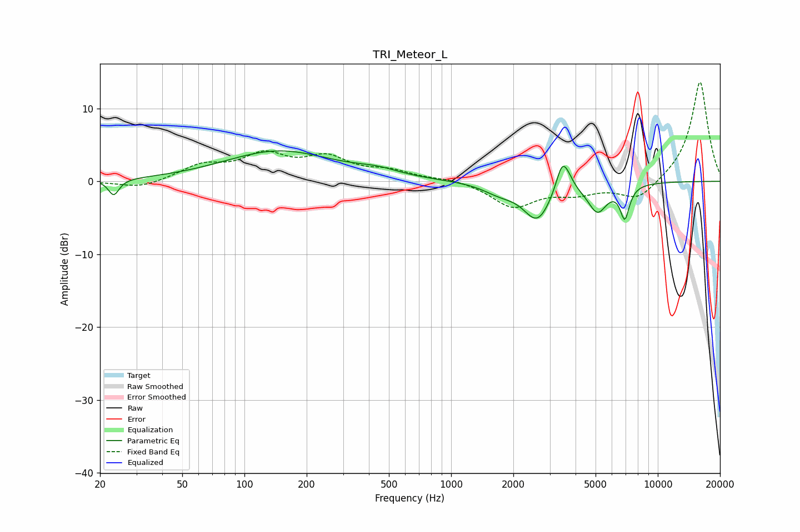

# TRI_Meteor_L
See [usage instructions](https://github.com/jaakkopasanen/AutoEq#usage) for more options and info.

### Parametric EQs
Apply preamp of -4.3 dB when using parametric equalizer.

|   # | Type    |   Fc (Hz) |    Q |   Gain (dB) |
|-----|---------|-----------|------|-------------|
|   1 | Peaking |        23 | 5.59 |        -2.2 |
|   2 | Peaking |       147 | 0.53 |         4.1 |
|   3 | Peaking |       441 | 1.36 |         0.8 |
|   4 | Peaking |      1713 | 1.76 |        -1.2 |
|   5 | Peaking |      2613 | 2.08 |        -5.1 |
|   6 | Peaking |      3445 | 4.63 |         4.2 |
|   7 | Peaking |      3699 | 5.05 |         0.9 |
|   8 | Peaking |      5107 | 3.03 |        -3.8 |
|   9 | Peaking |      6902 | 5.98 |         0.9 |
|  10 | Peaking |      6921 | 6    |        -5.3 |

### Fixed Band EQs
When using fixed band (also called graphic) equalizer, apply preamp of **-13.7 dB** (if available) and set gains manually with these parameters.

|   # | Type    |   Fc (Hz) |    Q |   Gain (dB) |
|-----|---------|-----------|------|-------------|
|   1 | Peaking |        31 | 1.41 |        -1   |
|   2 | Peaking |        62 | 1.41 |         2   |
|   3 | Peaking |       125 | 1.41 |         3.3 |
|   4 | Peaking |       250 | 1.41 |         2.9 |
|   5 | Peaking |       500 | 1.41 |         1.2 |
|   6 | Peaking |      1000 | 1.41 |         0.4 |
|   7 | Peaking |      2000 | 1.41 |        -3.5 |
|   8 | Peaking |      4000 | 1.41 |        -1.4 |
|   9 | Peaking |      8000 | 1.41 |        -2.7 |
|  10 | Peaking |     16000 | 1.41 |        13.8 |

### Graphs

