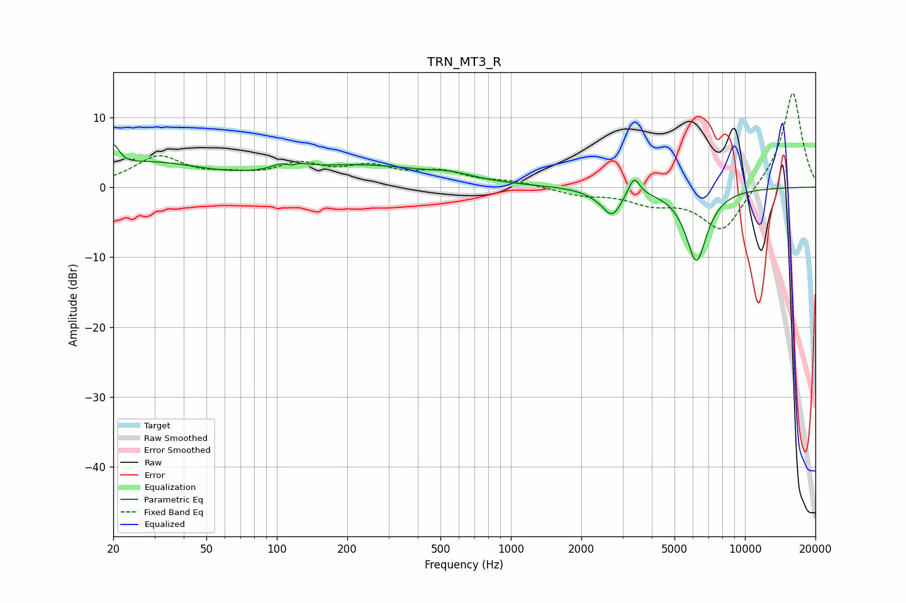

# TRN_MT3_R
See [usage instructions](https://github.com/jaakkopasanen/AutoEq#usage) for more options and info.

### Parametric EQs
Apply preamp of -6.2 dB when using parametric equalizer.

|   # | Type    |   Fc (Hz) |    Q |   Gain (dB) |
|-----|---------|-----------|------|-------------|
|   1 | Peaking |        20 | 5.79 |         3.2 |
|   2 | Peaking |        29 | 0.62 |         3.3 |
|   3 | Peaking |       114 | 3.01 |         2.7 |
|   4 | Peaking |       115 | 4.63 |        -1.9 |
|   5 | Peaking |       232 | 0.5  |         2.9 |
|   6 | Peaking |       560 | 1.5  |         0.8 |
|   7 | Peaking |      2355 | 2.2  |        -0.6 |
|   8 | Peaking |      2711 | 3.62 |        -3.4 |
|   9 | Peaking |      3358 | 5.9  |         2.8 |
|  10 | Peaking |      6202 | 2.95 |       -10.5 |

### Fixed Band EQs
When using fixed band (also called graphic) equalizer, apply preamp of **-13.5 dB** (if available) and set gains manually with these parameters.

|   # | Type    |   Fc (Hz) |    Q |   Gain (dB) |
|-----|---------|-----------|------|-------------|
|   1 | Peaking |        31 | 1.41 |         4.1 |
|   2 | Peaking |        62 | 1.41 |         1.1 |
|   3 | Peaking |       125 | 1.41 |         2.8 |
|   4 | Peaking |       250 | 1.41 |         2.4 |
|   5 | Peaking |       500 | 1.41 |         1.9 |
|   6 | Peaking |      1000 | 1.41 |         0.7 |
|   7 | Peaking |      2000 | 1.41 |        -1   |
|   8 | Peaking |      4000 | 1.41 |        -2   |
|   9 | Peaking |      8000 | 1.41 |        -6.6 |
|  10 | Peaking |     16000 | 1.41 |        13.9 |

### Graphs

