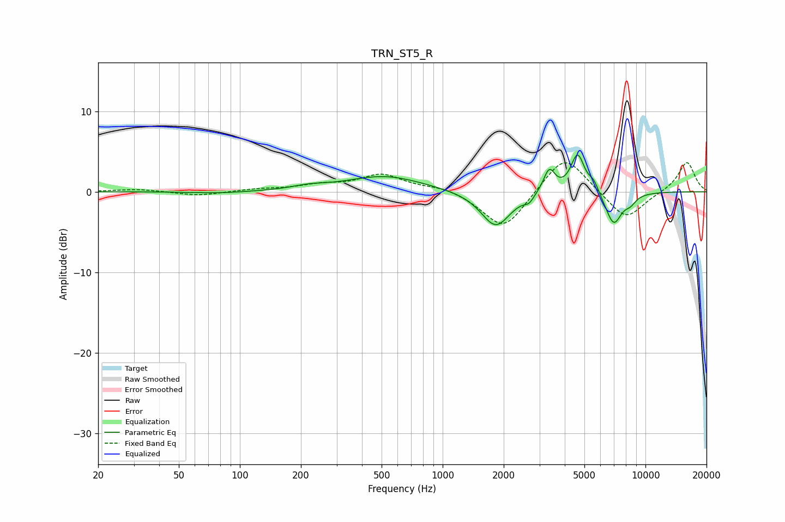

# TRN_ST5_R
See [usage instructions](https://github.com/jaakkopasanen/AutoEq#usage) for more options and info.

### Parametric EQs
Apply preamp of -4.7 dB when using parametric equalizer.

|   # | Type    |   Fc (Hz) |    Q |   Gain (dB) |
|-----|---------|-----------|------|-------------|
|   1 | Peaking |        79 | 1.04 |        -0.2 |
|   2 | Peaking |       219 | 1.71 |         0.4 |
|   3 | Peaking |       518 | 0.76 |         1.9 |
|   4 | Peaking |      1827 | 1.94 |        -4.4 |
|   5 | Peaking |      2666 | 5.99 |        -0.8 |
|   6 | Peaking |      3355 | 4.95 |         2.9 |
|   7 | Peaking |      4630 | 4.1  |         4.7 |
|   8 | Peaking |      5554 | 5.64 |         1.2 |
|   9 | Peaking |      6970 | 3.36 |        -4   |
|  10 | Peaking |      8427 | 4.58 |        -0.9 |

### Fixed Band EQs
When using fixed band (also called graphic) equalizer, apply preamp of **-3.7 dB** (if available) and set gains manually with these parameters.

|   # | Type    |   Fc (Hz) |    Q |   Gain (dB) |
|-----|---------|-----------|------|-------------|
|   1 | Peaking |        31 | 1.41 |         0.3 |
|   2 | Peaking |        62 | 1.41 |        -0.5 |
|   3 | Peaking |       125 | 1.41 |         0.3 |
|   4 | Peaking |       250 | 1.41 |         0.7 |
|   5 | Peaking |       500 | 1.41 |         2.1 |
|   6 | Peaking |      1000 | 1.41 |         0.6 |
|   7 | Peaking |      2000 | 1.41 |        -4.9 |
|   8 | Peaking |      4000 | 1.41 |         4.9 |
|   9 | Peaking |      8000 | 1.41 |        -3.6 |
|  10 | Peaking |     16000 | 1.41 |         3.8 |

### Graphs

