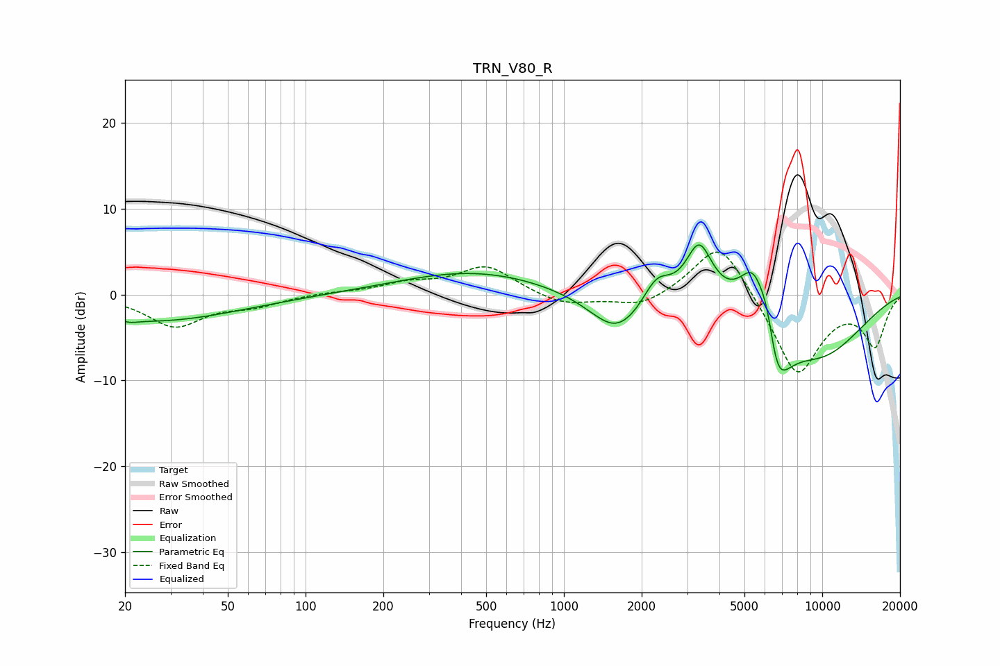

# TRN_V80_R
See [usage instructions](https://github.com/jaakkopasanen/AutoEq#usage) for more options and info.

### Parametric EQs
Apply preamp of -5.9 dB when using parametric equalizer.

|   # | Type    |   Fc (Hz) |    Q |   Gain (dB) |
|-----|---------|-----------|------|-------------|
|   1 | Peaking |        21 | 4.85 |        -0.3 |
|   2 | Peaking |        26 | 0.43 |        -3.1 |
|   3 | Peaking |       449 | 0.48 |         2.7 |
|   4 | Peaking |      1605 | 1.32 |        -4.8 |
|   5 | Peaking |      2287 | 2.63 |         3.1 |
|   6 | Peaking |      3339 | 2.67 |         6.7 |
|   7 | Peaking |      5441 | 2.28 |         7.8 |
|   8 | Peaking |      6159 | 4.21 |         4.5 |
|   9 | Peaking |      6586 | 2.41 |        -9.7 |
|  10 | Peaking |      9749 | 0.64 |        -6.8 |

### Fixed Band EQs
When using fixed band (also called graphic) equalizer, apply preamp of **-5.1 dB** (if available) and set gains manually with these parameters.

|   # | Type    |   Fc (Hz) |    Q |   Gain (dB) |
|-----|---------|-----------|------|-------------|
|   1 | Peaking |        31 | 1.41 |        -3.6 |
|   2 | Peaking |        62 | 1.41 |        -1.1 |
|   3 | Peaking |       125 | 1.41 |         0.2 |
|   4 | Peaking |       250 | 1.41 |         1.2 |
|   5 | Peaking |       500 | 1.41 |         3.3 |
|   6 | Peaking |      1000 | 1.41 |        -1.3 |
|   7 | Peaking |      2000 | 1.41 |        -1.6 |
|   8 | Peaking |      4000 | 1.41 |         6.8 |
|   9 | Peaking |      8000 | 1.41 |        -9.7 |
|  10 | Peaking |     16000 | 1.41 |        -5.7 |

### Graphs

