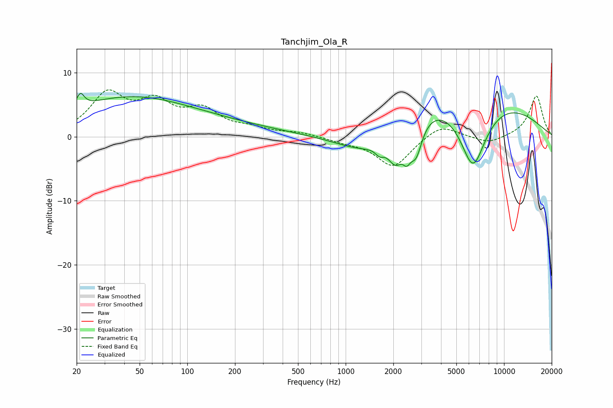

# Tanchjim_Ola_R
See [usage instructions](https://github.com/jaakkopasanen/AutoEq#usage) for more options and info.

### Parametric EQs
Apply preamp of -6.9 dB when using parametric equalizer.

|   # | Type    |   Fc (Hz) |    Q |   Gain (dB) |
|-----|---------|-----------|------|-------------|
|   1 | Peaking |        21 | 5.99 |         2.1 |
|   2 | Peaking |        39 | 0.36 |         4.3 |
|   3 | Peaking |        87 | 0.25 |         2.2 |
|   4 | Peaking |      1353 | 0.72 |        -4.6 |
|   5 | Peaking |      1636 | 5.24 |        -1.1 |
|   6 | Peaking |      2073 | 2.69 |        -4.9 |
|   7 | Peaking |      2430 | 5.93 |        -2.3 |
|   8 | Peaking |      2781 | 3.55 |        -5.1 |
|   9 | Peaking |      5200 | 0.29 |         8.5 |
|  10 | Peaking |      6363 | 1.47 |       -11.9 |

### Fixed Band EQs
When using fixed band (also called graphic) equalizer, apply preamp of **-7.4 dB** (if available) and set gains manually with these parameters.

|   # | Type    |   Fc (Hz) |    Q |   Gain (dB) |
|-----|---------|-----------|------|-------------|
|   1 | Peaking |        31 | 1.41 |         6.3 |
|   2 | Peaking |        62 | 1.41 |         4.5 |
|   3 | Peaking |       125 | 1.41 |         3.6 |
|   4 | Peaking |       250 | 1.41 |         1   |
|   5 | Peaking |       500 | 1.41 |         0.6 |
|   6 | Peaking |      1000 | 1.41 |        -0.6 |
|   7 | Peaking |      2000 | 1.41 |        -4.7 |
|   8 | Peaking |      4000 | 1.41 |         2.1 |
|   9 | Peaking |      8000 | 1.41 |        -1.1 |
|  10 | Peaking |     16000 | 1.41 |         6.4 |

### Graphs

