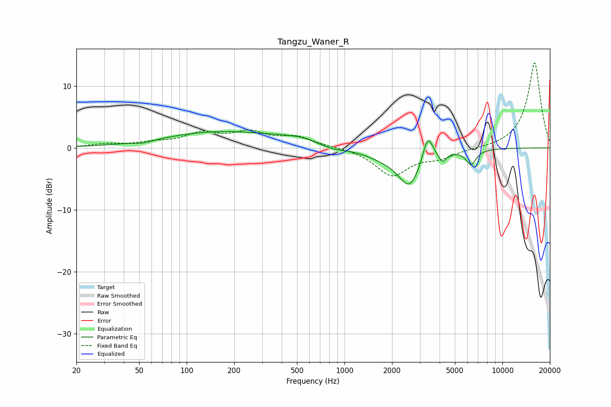

# Tangzu_Waner_R
See [usage instructions](https://github.com/jaakkopasanen/AutoEq#usage) for more options and info.

### Parametric EQs
Apply preamp of -2.7 dB when using parametric equalizer.

|   # | Type    |   Fc (Hz) |    Q |   Gain (dB) |
|-----|---------|-----------|------|-------------|
|   1 | Peaking |        53 | 2.65 |        -0.4 |
|   2 | Peaking |       173 | 0.37 |         2.6 |
|   3 | Peaking |       395 | 1.66 |         0.2 |
|   4 | Peaking |       539 | 1.58 |         0.6 |
|   5 | Peaking |       849 | 1.84 |        -0.6 |
|   6 | Peaking |      1766 | 1.15 |        -1.2 |
|   7 | Peaking |      2583 | 1.99 |        -5.7 |
|   8 | Peaking |      3364 | 4.52 |         4.2 |
|   9 | Peaking |      4177 | 5.99 |        -1.6 |
|  10 | Peaking |      6332 | 4.27 |        -2.4 |

### Fixed Band EQs
When using fixed band (also called graphic) equalizer, apply preamp of **-13.8 dB** (if available) and set gains manually with these parameters.

|   # | Type    |   Fc (Hz) |    Q |   Gain (dB) |
|-----|---------|-----------|------|-------------|
|   1 | Peaking |        31 | 1.41 |         0.5 |
|   2 | Peaking |        62 | 1.41 |         0.7 |
|   3 | Peaking |       125 | 1.41 |         2.1 |
|   4 | Peaking |       250 | 1.41 |         2.2 |
|   5 | Peaking |       500 | 1.41 |         1.6 |
|   6 | Peaking |      1000 | 1.41 |         0.1 |
|   7 | Peaking |      2000 | 1.41 |        -4.4 |
|   8 | Peaking |      4000 | 1.41 |        -1.4 |
|   9 | Peaking |      8000 | 1.41 |        -0.1 |
|  10 | Peaking |     16000 | 1.41 |        13.8 |

### Graphs

